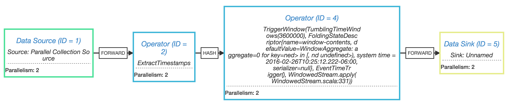
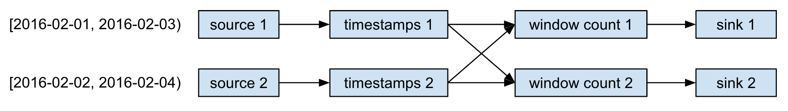
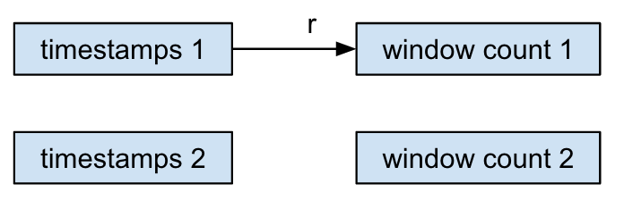
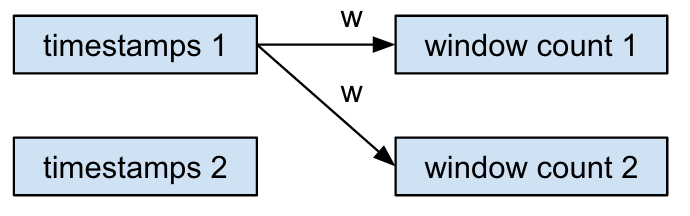
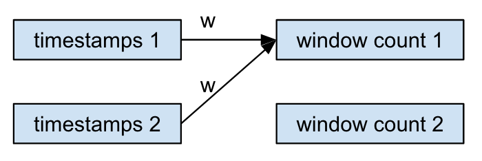

## Overview

See [this Flink mailing list thread](http://apache-flink-user-mailing-list-archive.2336050.n4.nabble.com/Watermarks-with-repartition-tt5165.html). For more background on watermarks, triggers, and windows in relation to unbounded stream processing, see this excellent series: [part 1](https://www.oreilly.com/ideas/the-world-beyond-batch-streaming-101) and [part 2](https://www.oreilly.com/ideas/the-world-beyond-batch-streaming-101).

This is a simple example that shows what happens in a Flink job when timestamps and watermarks from parallel source partitions diverge over time.

## Example Job

The job is a simple keyed window count, counting the number of pageviews per hour by url. The job graph looks like:



The events come from a source with 2 partitions, and job parallelism=2, so the execution graph looks like:



The event timestamps (and watermarks) in the 2 source partitions are skewed by 1 day. While this would not normally happen when the stream processor is "caught up" with the head of the stream, this could very well happen if we are reprocessing a large batch of historical events, to say, backfill a queryable database. 

We're primarily interested in what happens at each window count task; each of these
tasks will receive events and watermarks from each of the sources, with timestamps skewed by 1 day. Does Flink handle this properly, and only trigger the windows when the 
slowest watermark has passed the end of the window?

The answer is *yes*: each Flink task broadcasts its watermarks to all downstream tasks, tracks incoming watermarks from all upstream tasks separately, and computes its
own watermark as the minimum incoming watermark. So each task progresses through event time only as fast as its slowest input, as expected.

## Watermark Propagation

A task typically emits a single record to a single downstream task:



However, when a task's watermark advances it broadcasts that watermark to all possible downstream tasks:



When a hash partition is used (becasuse of a `keyBy` operation on the stream) each downstream task can receive records from all upstream tasks:


Each task also receives watermarks from all upstream tasks:



The task tracks the max incoming watermark from each upstream task separately. As an incoming watermark advances, the task computes its own watermark as the min
of all incoming watermarks. As the task's watermark advances, its provides this watermark to its operator so it can do things like trigger the output of windows, and it also broadcasts it to all downstream tasks.

## Observations

You should be able to execute this example program locally by doing `sbt run`. Output will be something like what is shown below. Note that there are approximately 
350-400 pageviews per url per hour on 2016-02-01, and each hour window is triggered roughly every 5 seconds in processing time. Then there are approximately 700 
pageviews per url per hour on 2016-02-02, since the 2 source partitions overlap on that day. Again these windows are triggered every 5 seconds in processing time.
Then 2016-02-03 has approx 350-400 pageviews per url per hour, but notice that all windows on this day are triggered almost simultaneously in processing time.

After the program starts, the window count tasks are receiving events and watermarks from the 2 source partitions, progressing through 2016-02-01 and 2016-02-02, concurrently. 
However, the window count tasks' watermarks are only progressing through the min of these, on 2016-02-01. Windows on 2016-02-01 are being built up and triggered. Windows on 
2016-02-02 are also being built up, but not triggered yet, since the watermarks are still on 2016-02-01. This continues as the source partitions progress to 2016-02-02 and 2016-02-03, respectively.

At the end of the program, both streams finish, and the window count tasks' watermarks jump through 2016-02-03, allowing all of those windows to trigger very quickly.

```
02/26/2016 10:25:14 Job execution switched to status RUNNING.
02/26/2016 10:25:14 Source: Parallel Collection Source -> ExtractTimestamps(1/2) switched to SCHEDULED
02/26/2016 10:25:14 Source: Parallel Collection Source -> ExtractTimestamps(1/2) switched to DEPLOYING
02/26/2016 10:25:14 Source: Parallel Collection Source -> ExtractTimestamps(2/2) switched to SCHEDULED
02/26/2016 10:25:14 Source: Parallel Collection Source -> ExtractTimestamps(2/2) switched to DEPLOYING
02/26/2016 10:25:14 TriggerWindow(TumblingTimeWindows(3600000), FoldingStateDescriptor{name=window-contents, defaultValue=WindowAggregate: aggregate=0 for key=<key undefined> in [<start undefined>, <end undefined>), system time = 2016-02-26T10:25:12.222-06:00, serializer=null}, EventTimeTrigger(), WindowedStream.apply(WindowedStream.scala:331)) -> Sink: Unnamed(1/2) switched to SCHEDULED
02/26/2016 10:25:14 TriggerWindow(TumblingTimeWindows(3600000), FoldingStateDescriptor{name=window-contents, defaultValue=WindowAggregate: aggregate=0 for key=<key undefined> in [<start undefined>, <end undefined>), system time = 2016-02-26T10:25:12.222-06:00, serializer=null}, EventTimeTrigger(), WindowedStream.apply(WindowedStream.scala:331)) -> Sink: Unnamed(1/2) switched to DEPLOYING
02/26/2016 10:25:14 TriggerWindow(TumblingTimeWindows(3600000), FoldingStateDescriptor{name=window-contents, defaultValue=WindowAggregate: aggregate=0 for key=<key undefined> in [<start undefined>, <end undefined>), system time = 2016-02-26T10:25:12.222-06:00, serializer=null}, EventTimeTrigger(), WindowedStream.apply(WindowedStream.scala:331)) -> Sink: Unnamed(2/2) switched to SCHEDULED
02/26/2016 10:25:14 TriggerWindow(TumblingTimeWindows(3600000), FoldingStateDescriptor{name=window-contents, defaultValue=WindowAggregate: aggregate=0 for key=<key undefined> in [<start undefined>, <end undefined>), system time = 2016-02-26T10:25:12.222-06:00, serializer=null}, EventTimeTrigger(), WindowedStream.apply(WindowedStream.scala:331)) -> Sink: Unnamed(2/2) switched to DEPLOYING
02/26/2016 10:25:14 Source: Parallel Collection Source -> ExtractTimestamps(1/2) switched to RUNNING
02/26/2016 10:25:14 TriggerWindow(TumblingTimeWindows(3600000), FoldingStateDescriptor{name=window-contents, defaultValue=WindowAggregate: aggregate=0 for key=<key undefined> in [<start undefined>, <end undefined>), system time = 2016-02-26T10:25:12.222-06:00, serializer=null}, EventTimeTrigger(), WindowedStream.apply(WindowedStream.scala:331)) -> Sink: Unnamed(2/2) switched to RUNNING
02/26/2016 10:25:14 TriggerWindow(TumblingTimeWindows(3600000), FoldingStateDescriptor{name=window-contents, defaultValue=WindowAggregate: aggregate=0 for key=<key undefined> in [<start undefined>, <end undefined>), system time = 2016-02-26T10:25:12.222-06:00, serializer=null}, EventTimeTrigger(), WindowedStream.apply(WindowedStream.scala:331)) -> Sink: Unnamed(1/2) switched to RUNNING
02/26/2016 10:25:14 Source: Parallel Collection Source -> ExtractTimestamps(2/2) switched to RUNNING
1> WindowAggregate: aggregate=358 for key=http://site.com/7 in [2016-02-01T00:00:00.000Z, 2016-02-01T01:00:00.000Z), system time = 2016-02-26T10:25:20.342-06:00
2> WindowAggregate: aggregate=366 for key=http://site.com/2 in [2016-02-01T00:00:00.000Z, 2016-02-01T01:00:00.000Z), system time = 2016-02-26T10:25:20.342-06:00
1> WindowAggregate: aggregate=355 for key=http://site.com/3 in [2016-02-01T00:00:00.000Z, 2016-02-01T01:00:00.000Z), system time = 2016-02-26T10:25:20.342-06:00
2> WindowAggregate: aggregate=374 for key=http://site.com/6 in [2016-02-01T00:00:00.000Z, 2016-02-01T01:00:00.000Z), system time = 2016-02-26T10:25:20.342-06:00
1> WindowAggregate: aggregate=364 for key=http://site.com/9 in [2016-02-01T00:00:00.000Z, 2016-02-01T01:00:00.000Z), system time = 2016-02-26T10:25:20.342-06:00
2> WindowAggregate: aggregate=366 for key=http://site.com/8 in [2016-02-01T00:00:00.000Z, 2016-02-01T01:00:00.000Z), system time = 2016-02-26T10:25:20.342-06:00
1> WindowAggregate: aggregate=349 for key=http://site.com/5 in [2016-02-01T00:00:00.000Z, 2016-02-01T01:00:00.000Z), system time = 2016-02-26T10:25:20.342-06:00
2> WindowAggregate: aggregate=370 for key=http://site.com/4 in [2016-02-01T00:00:00.000Z, 2016-02-01T01:00:00.000Z), system time = 2016-02-26T10:25:20.342-06:00
1> WindowAggregate: aggregate=340 for key=http://site.com/1 in [2016-02-01T00:00:00.000Z, 2016-02-01T01:00:00.000Z), system time = 2016-02-26T10:25:20.343-06:00
2> WindowAggregate: aggregate=358 for key=http://site.com/0 in [2016-02-01T00:00:00.000Z, 2016-02-01T01:00:00.000Z), system time = 2016-02-26T10:25:20.343-06:00
1> WindowAggregate: aggregate=377 for key=http://site.com/7 in [2016-02-01T01:00:00.000Z, 2016-02-01T02:00:00.000Z), system time = 2016-02-26T10:25:24.999-06:00
2> WindowAggregate: aggregate=353 for key=http://site.com/4 in [2016-02-01T01:00:00.000Z, 2016-02-01T02:00:00.000Z), system time = 2016-02-26T10:25:24.999-06:00
1> WindowAggregate: aggregate=340 for key=http://site.com/3 in [2016-02-01T01:00:00.000Z, 2016-02-01T02:00:00.000Z), system time = 2016-02-26T10:25:25.000-06:00
2> WindowAggregate: aggregate=383 for key=http://site.com/8 in [2016-02-01T01:00:00.000Z, 2016-02-01T02:00:00.000Z), system time = 2016-02-26T10:25:25.000-06:00
1> WindowAggregate: aggregate=358 for key=http://site.com/9 in [2016-02-01T01:00:00.000Z, 2016-02-01T02:00:00.000Z), system time = 2016-02-26T10:25:25.000-06:00
2> WindowAggregate: aggregate=340 for key=http://site.com/6 in [2016-02-01T01:00:00.000Z, 2016-02-01T02:00:00.000Z), system time = 2016-02-26T10:25:25.000-06:00
1> WindowAggregate: aggregate=367 for key=http://site.com/5 in [2016-02-01T01:00:00.000Z, 2016-02-01T02:00:00.000Z), system time = 2016-02-26T10:25:25.000-06:00
2> WindowAggregate: aggregate=337 for key=http://site.com/2 in [2016-02-01T01:00:00.000Z, 2016-02-01T02:00:00.000Z), system time = 2016-02-26T10:25:25.000-06:00
1> WindowAggregate: aggregate=377 for key=http://site.com/1 in [2016-02-01T01:00:00.000Z, 2016-02-01T02:00:00.000Z), system time = 2016-02-26T10:25:25.000-06:00
2> WindowAggregate: aggregate=368 for key=http://site.com/0 in [2016-02-01T01:00:00.000Z, 2016-02-01T02:00:00.000Z), system time = 2016-02-26T10:25:25.000-06:00
2> WindowAggregate: aggregate=369 for key=http://site.com/6 in [2016-02-01T02:00:00.000Z, 2016-02-01T03:00:00.000Z), system time = 2016-02-26T10:25:29.661-06:00
1> WindowAggregate: aggregate=359 for key=http://site.com/1 in [2016-02-01T02:00:00.000Z, 2016-02-01T03:00:00.000Z), system time = 2016-02-26T10:25:29.661-06:00
2> WindowAggregate: aggregate=383 for key=http://site.com/4 in [2016-02-01T02:00:00.000Z, 2016-02-01T03:00:00.000Z), system time = 2016-02-26T10:25:29.662-06:00
1> WindowAggregate: aggregate=348 for key=http://site.com/7 in [2016-02-01T02:00:00.000Z, 2016-02-01T03:00:00.000Z), system time = 2016-02-26T10:25:29.662-06:00
2> WindowAggregate: aggregate=372 for key=http://site.com/2 in [2016-02-01T02:00:00.000Z, 2016-02-01T03:00:00.000Z), system time = 2016-02-26T10:25:29.662-06:00
1> WindowAggregate: aggregate=365 for key=http://site.com/9 in [2016-02-01T02:00:00.000Z, 2016-02-01T03:00:00.000Z), system time = 2016-02-26T10:25:29.662-06:00
2> WindowAggregate: aggregate=342 for key=http://site.com/0 in [2016-02-01T02:00:00.000Z, 2016-02-01T03:00:00.000Z), system time = 2016-02-26T10:25:29.662-06:00
1> WindowAggregate: aggregate=363 for key=http://site.com/5 in [2016-02-01T02:00:00.000Z, 2016-02-01T03:00:00.000Z), system time = 2016-02-26T10:25:29.662-06:00
2> WindowAggregate: aggregate=370 for key=http://site.com/8 in [2016-02-01T02:00:00.000Z, 2016-02-01T03:00:00.000Z), system time = 2016-02-26T10:25:29.662-06:00
1> WindowAggregate: aggregate=329 for key=http://site.com/3 in [2016-02-01T02:00:00.000Z, 2016-02-01T03:00:00.000Z), system time = 2016-02-26T10:25:29.662-06:00
2> WindowAggregate: aggregate=367 for key=http://site.com/4 in [2016-02-01T03:00:00.000Z, 2016-02-01T04:00:00.000Z), system time = 2016-02-26T10:25:34.312-06:00
1> WindowAggregate: aggregate=365 for key=http://site.com/5 in [2016-02-01T03:00:00.000Z, 2016-02-01T04:00:00.000Z), system time = 2016-02-26T10:25:34.312-06:00
2> WindowAggregate: aggregate=354 for key=http://site.com/6 in [2016-02-01T03:00:00.000Z, 2016-02-01T04:00:00.000Z), system time = 2016-02-26T10:25:34.312-06:00
1> WindowAggregate: aggregate=369 for key=http://site.com/1 in [2016-02-01T03:00:00.000Z, 2016-02-01T04:00:00.000Z), system time = 2016-02-26T10:25:34.312-06:00
2> WindowAggregate: aggregate=340 for key=http://site.com/2 in [2016-02-01T03:00:00.000Z, 2016-02-01T04:00:00.000Z), system time = 2016-02-26T10:25:34.312-06:00
1> WindowAggregate: aggregate=355 for key=http://site.com/9 in [2016-02-01T03:00:00.000Z, 2016-02-01T04:00:00.000Z), system time = 2016-02-26T10:25:34.312-06:00
2> WindowAggregate: aggregate=366 for key=http://site.com/0 in [2016-02-01T03:00:00.000Z, 2016-02-01T04:00:00.000Z), system time = 2016-02-26T10:25:34.312-06:00
1> WindowAggregate: aggregate=347 for key=http://site.com/7 in [2016-02-01T03:00:00.000Z, 2016-02-01T04:00:00.000Z), system time = 2016-02-26T10:25:34.312-06:00
2> WindowAggregate: aggregate=392 for key=http://site.com/8 in [2016-02-01T03:00:00.000Z, 2016-02-01T04:00:00.000Z), system time = 2016-02-26T10:25:34.312-06:00
1> WindowAggregate: aggregate=345 for key=http://site.com/3 in [2016-02-01T03:00:00.000Z, 2016-02-01T04:00:00.000Z), system time = 2016-02-26T10:25:34.312-06:00
1> WindowAggregate: aggregate=350 for key=http://site.com/5 in [2016-02-01T04:00:00.000Z, 2016-02-01T05:00:00.000Z), system time = 2016-02-26T10:25:38.872-06:00
2> WindowAggregate: aggregate=359 for key=http://site.com/2 in [2016-02-01T04:00:00.000Z, 2016-02-01T05:00:00.000Z), system time = 2016-02-26T10:25:38.872-06:00
2> WindowAggregate: aggregate=365 for key=http://site.com/6 in [2016-02-01T04:00:00.000Z, 2016-02-01T05:00:00.000Z), system time = 2016-02-26T10:25:38.872-06:00
1> WindowAggregate: aggregate=361 for key=http://site.com/7 in [2016-02-01T04:00:00.000Z, 2016-02-01T05:00:00.000Z), system time = 2016-02-26T10:25:38.872-06:00
2> WindowAggregate: aggregate=351 for key=http://site.com/8 in [2016-02-01T04:00:00.000Z, 2016-02-01T05:00:00.000Z), system time = 2016-02-26T10:25:38.872-06:00
1> WindowAggregate: aggregate=380 for key=http://site.com/9 in [2016-02-01T04:00:00.000Z, 2016-02-01T05:00:00.000Z), system time = 2016-02-26T10:25:38.872-06:00
2> WindowAggregate: aggregate=382 for key=http://site.com/0 in [2016-02-01T04:00:00.000Z, 2016-02-01T05:00:00.000Z), system time = 2016-02-26T10:25:38.872-06:00
2> WindowAggregate: aggregate=333 for key=http://site.com/4 in [2016-02-01T04:00:00.000Z, 2016-02-01T05:00:00.000Z), system time = 2016-02-26T10:25:38.872-06:00
1> WindowAggregate: aggregate=327 for key=http://site.com/3 in [2016-02-01T04:00:00.000Z, 2016-02-01T05:00:00.000Z), system time = 2016-02-26T10:25:38.872-06:00
1> WindowAggregate: aggregate=392 for key=http://site.com/1 in [2016-02-01T04:00:00.000Z, 2016-02-01T05:00:00.000Z), system time = 2016-02-26T10:25:38.872-06:00
2> WindowAggregate: aggregate=393 for key=http://site.com/0 in [2016-02-01T05:00:00.000Z, 2016-02-01T06:00:00.000Z), system time = 2016-02-26T10:25:43.520-06:00
1> WindowAggregate: aggregate=379 for key=http://site.com/5 in [2016-02-01T05:00:00.000Z, 2016-02-01T06:00:00.000Z), system time = 2016-02-26T10:25:43.520-06:00
2> WindowAggregate: aggregate=344 for key=http://site.com/2 in [2016-02-01T05:00:00.000Z, 2016-02-01T06:00:00.000Z), system time = 2016-02-26T10:25:43.520-06:00
1> WindowAggregate: aggregate=355 for key=http://site.com/3 in [2016-02-01T05:00:00.000Z, 2016-02-01T06:00:00.000Z), system time = 2016-02-26T10:25:43.520-06:00
2> WindowAggregate: aggregate=320 for key=http://site.com/8 in [2016-02-01T05:00:00.000Z, 2016-02-01T06:00:00.000Z), system time = 2016-02-26T10:25:43.520-06:00
2> WindowAggregate: aggregate=367 for key=http://site.com/4 in [2016-02-01T05:00:00.000Z, 2016-02-01T06:00:00.000Z), system time = 2016-02-26T10:25:43.520-06:00
1> WindowAggregate: aggregate=315 for key=http://site.com/1 in [2016-02-01T05:00:00.000Z, 2016-02-01T06:00:00.000Z), system time = 2016-02-26T10:25:43.520-06:00
2> WindowAggregate: aggregate=374 for key=http://site.com/6 in [2016-02-01T05:00:00.000Z, 2016-02-01T06:00:00.000Z), system time = 2016-02-26T10:25:43.521-06:00
1> WindowAggregate: aggregate=381 for key=http://site.com/9 in [2016-02-01T05:00:00.000Z, 2016-02-01T06:00:00.000Z), system time = 2016-02-26T10:25:43.521-06:00
1> WindowAggregate: aggregate=372 for key=http://site.com/7 in [2016-02-01T05:00:00.000Z, 2016-02-01T06:00:00.000Z), system time = 2016-02-26T10:25:43.521-06:00
1> WindowAggregate: aggregate=400 for key=http://site.com/7 in [2016-02-01T06:00:00.000Z, 2016-02-01T07:00:00.000Z), system time = 2016-02-26T10:25:48.252-06:00
2> WindowAggregate: aggregate=369 for key=http://site.com/6 in [2016-02-01T06:00:00.000Z, 2016-02-01T07:00:00.000Z), system time = 2016-02-26T10:25:48.252-06:00
1> WindowAggregate: aggregate=359 for key=http://site.com/1 in [2016-02-01T06:00:00.000Z, 2016-02-01T07:00:00.000Z), system time = 2016-02-26T10:25:48.252-06:00
2> WindowAggregate: aggregate=356 for key=http://site.com/4 in [2016-02-01T06:00:00.000Z, 2016-02-01T07:00:00.000Z), system time = 2016-02-26T10:25:48.252-06:00
1> WindowAggregate: aggregate=353 for key=http://site.com/5 in [2016-02-01T06:00:00.000Z, 2016-02-01T07:00:00.000Z), system time = 2016-02-26T10:25:48.252-06:00
2> WindowAggregate: aggregate=384 for key=http://site.com/2 in [2016-02-01T06:00:00.000Z, 2016-02-01T07:00:00.000Z), system time = 2016-02-26T10:25:48.252-06:00
1> WindowAggregate: aggregate=344 for key=http://site.com/3 in [2016-02-01T06:00:00.000Z, 2016-02-01T07:00:00.000Z), system time = 2016-02-26T10:25:48.252-06:00
2> WindowAggregate: aggregate=331 for key=http://site.com/8 in [2016-02-01T06:00:00.000Z, 2016-02-01T07:00:00.000Z), system time = 2016-02-26T10:25:48.252-06:00
1> WindowAggregate: aggregate=350 for key=http://site.com/9 in [2016-02-01T06:00:00.000Z, 2016-02-01T07:00:00.000Z), system time = 2016-02-26T10:25:48.252-06:00
2> WindowAggregate: aggregate=354 for key=http://site.com/0 in [2016-02-01T06:00:00.000Z, 2016-02-01T07:00:00.000Z), system time = 2016-02-26T10:25:48.252-06:00
1> WindowAggregate: aggregate=348 for key=http://site.com/3 in [2016-02-01T07:00:00.000Z, 2016-02-01T08:00:00.000Z), system time = 2016-02-26T10:25:52.894-06:00
2> WindowAggregate: aggregate=358 for key=http://site.com/2 in [2016-02-01T07:00:00.000Z, 2016-02-01T08:00:00.000Z), system time = 2016-02-26T10:25:52.894-06:00
2> WindowAggregate: aggregate=360 for key=http://site.com/0 in [2016-02-01T07:00:00.000Z, 2016-02-01T08:00:00.000Z), system time = 2016-02-26T10:25:52.894-06:00
1> WindowAggregate: aggregate=366 for key=http://site.com/7 in [2016-02-01T07:00:00.000Z, 2016-02-01T08:00:00.000Z), system time = 2016-02-26T10:25:52.894-06:00
2> WindowAggregate: aggregate=364 for key=http://site.com/8 in [2016-02-01T07:00:00.000Z, 2016-02-01T08:00:00.000Z), system time = 2016-02-26T10:25:52.894-06:00
1> WindowAggregate: aggregate=374 for key=http://site.com/9 in [2016-02-01T07:00:00.000Z, 2016-02-01T08:00:00.000Z), system time = 2016-02-26T10:25:52.894-06:00
2> WindowAggregate: aggregate=373 for key=http://site.com/4 in [2016-02-01T07:00:00.000Z, 2016-02-01T08:00:00.000Z), system time = 2016-02-26T10:25:52.894-06:00
1> WindowAggregate: aggregate=379 for key=http://site.com/5 in [2016-02-01T07:00:00.000Z, 2016-02-01T08:00:00.000Z), system time = 2016-02-26T10:25:52.894-06:00
2> WindowAggregate: aggregate=344 for key=http://site.com/6 in [2016-02-01T07:00:00.000Z, 2016-02-01T08:00:00.000Z), system time = 2016-02-26T10:25:52.894-06:00
1> WindowAggregate: aggregate=334 for key=http://site.com/1 in [2016-02-01T07:00:00.000Z, 2016-02-01T08:00:00.000Z), system time = 2016-02-26T10:25:52.894-06:00
1> WindowAggregate: aggregate=342 for key=http://site.com/1 in [2016-02-01T08:00:00.000Z, 2016-02-01T09:00:00.000Z), system time = 2016-02-26T10:25:57.540-06:00
2> WindowAggregate: aggregate=339 for key=http://site.com/2 in [2016-02-01T08:00:00.000Z, 2016-02-01T09:00:00.000Z), system time = 2016-02-26T10:25:57.540-06:00
1> WindowAggregate: aggregate=348 for key=http://site.com/3 in [2016-02-01T08:00:00.000Z, 2016-02-01T09:00:00.000Z), system time = 2016-02-26T10:25:57.540-06:00
2> WindowAggregate: aggregate=363 for key=http://site.com/4 in [2016-02-01T08:00:00.000Z, 2016-02-01T09:00:00.000Z), system time = 2016-02-26T10:25:57.540-06:00
1> WindowAggregate: aggregate=357 for key=http://site.com/7 in [2016-02-01T08:00:00.000Z, 2016-02-01T09:00:00.000Z), system time = 2016-02-26T10:25:57.540-06:00
2> WindowAggregate: aggregate=335 for key=http://site.com/6 in [2016-02-01T08:00:00.000Z, 2016-02-01T09:00:00.000Z), system time = 2016-02-26T10:25:57.540-06:00
1> WindowAggregate: aggregate=379 for key=http://site.com/5 in [2016-02-01T08:00:00.000Z, 2016-02-01T09:00:00.000Z), system time = 2016-02-26T10:25:57.540-06:00
2> WindowAggregate: aggregate=387 for key=http://site.com/0 in [2016-02-01T08:00:00.000Z, 2016-02-01T09:00:00.000Z), system time = 2016-02-26T10:25:57.540-06:00
1> WindowAggregate: aggregate=356 for key=http://site.com/9 in [2016-02-01T08:00:00.000Z, 2016-02-01T09:00:00.000Z), system time = 2016-02-26T10:25:57.540-06:00
2> WindowAggregate: aggregate=394 for key=http://site.com/8 in [2016-02-01T08:00:00.000Z, 2016-02-01T09:00:00.000Z), system time = 2016-02-26T10:25:57.540-06:00
2> WindowAggregate: aggregate=351 for key=http://site.com/8 in [2016-02-01T09:00:00.000Z, 2016-02-01T10:00:00.000Z), system time = 2016-02-26T10:26:02.278-06:00
1> WindowAggregate: aggregate=345 for key=http://site.com/9 in [2016-02-01T09:00:00.000Z, 2016-02-01T10:00:00.000Z), system time = 2016-02-26T10:26:02.278-06:00
2> WindowAggregate: aggregate=364 for key=http://site.com/4 in [2016-02-01T09:00:00.000Z, 2016-02-01T10:00:00.000Z), system time = 2016-02-26T10:26:02.278-06:00
1> WindowAggregate: aggregate=359 for key=http://site.com/3 in [2016-02-01T09:00:00.000Z, 2016-02-01T10:00:00.000Z), system time = 2016-02-26T10:26:02.278-06:00
2> WindowAggregate: aggregate=347 for key=http://site.com/6 in [2016-02-01T09:00:00.000Z, 2016-02-01T10:00:00.000Z), system time = 2016-02-26T10:26:02.278-06:00
1> WindowAggregate: aggregate=391 for key=http://site.com/5 in [2016-02-01T09:00:00.000Z, 2016-02-01T10:00:00.000Z), system time = 2016-02-26T10:26:02.278-06:00
2> WindowAggregate: aggregate=336 for key=http://site.com/2 in [2016-02-01T09:00:00.000Z, 2016-02-01T10:00:00.000Z), system time = 2016-02-26T10:26:02.278-06:00
1> WindowAggregate: aggregate=375 for key=http://site.com/7 in [2016-02-01T09:00:00.000Z, 2016-02-01T10:00:00.000Z), system time = 2016-02-26T10:26:02.278-06:00
2> WindowAggregate: aggregate=385 for key=http://site.com/0 in [2016-02-01T09:00:00.000Z, 2016-02-01T10:00:00.000Z), system time = 2016-02-26T10:26:02.278-06:00
1> WindowAggregate: aggregate=347 for key=http://site.com/1 in [2016-02-01T09:00:00.000Z, 2016-02-01T10:00:00.000Z), system time = 2016-02-26T10:26:02.279-06:00
2> WindowAggregate: aggregate=366 for key=http://site.com/4 in [2016-02-01T10:00:00.000Z, 2016-02-01T11:00:00.000Z), system time = 2016-02-26T10:26:06.921-06:00
1> WindowAggregate: aggregate=333 for key=http://site.com/5 in [2016-02-01T10:00:00.000Z, 2016-02-01T11:00:00.000Z), system time = 2016-02-26T10:26:06.921-06:00
2> WindowAggregate: aggregate=370 for key=http://site.com/8 in [2016-02-01T10:00:00.000Z, 2016-02-01T11:00:00.000Z), system time = 2016-02-26T10:26:06.921-06:00
1> WindowAggregate: aggregate=354 for key=http://site.com/9 in [2016-02-01T10:00:00.000Z, 2016-02-01T11:00:00.000Z), system time = 2016-02-26T10:26:06.922-06:00
2> WindowAggregate: aggregate=380 for key=http://site.com/0 in [2016-02-01T10:00:00.000Z, 2016-02-01T11:00:00.000Z), system time = 2016-02-26T10:26:06.922-06:00
1> WindowAggregate: aggregate=391 for key=http://site.com/7 in [2016-02-01T10:00:00.000Z, 2016-02-01T11:00:00.000Z), system time = 2016-02-26T10:26:06.922-06:00
2> WindowAggregate: aggregate=326 for key=http://site.com/2 in [2016-02-01T10:00:00.000Z, 2016-02-01T11:00:00.000Z), system time = 2016-02-26T10:26:06.922-06:00
1> WindowAggregate: aggregate=355 for key=http://site.com/3 in [2016-02-01T10:00:00.000Z, 2016-02-01T11:00:00.000Z), system time = 2016-02-26T10:26:06.922-06:00
2> WindowAggregate: aggregate=363 for key=http://site.com/6 in [2016-02-01T10:00:00.000Z, 2016-02-01T11:00:00.000Z), system time = 2016-02-26T10:26:06.922-06:00
1> WindowAggregate: aggregate=362 for key=http://site.com/1 in [2016-02-01T10:00:00.000Z, 2016-02-01T11:00:00.000Z), system time = 2016-02-26T10:26:06.922-06:00
1> WindowAggregate: aggregate=344 for key=http://site.com/1 in [2016-02-01T11:00:00.000Z, 2016-02-01T12:00:00.000Z), system time = 2016-02-26T10:26:11.574-06:00
2> WindowAggregate: aggregate=344 for key=http://site.com/6 in [2016-02-01T11:00:00.000Z, 2016-02-01T12:00:00.000Z), system time = 2016-02-26T10:26:11.574-06:00
2> WindowAggregate: aggregate=355 for key=http://site.com/2 in [2016-02-01T11:00:00.000Z, 2016-02-01T12:00:00.000Z), system time = 2016-02-26T10:26:11.574-06:00
1> WindowAggregate: aggregate=335 for key=http://site.com/9 in [2016-02-01T11:00:00.000Z, 2016-02-01T12:00:00.000Z), system time = 2016-02-26T10:26:11.574-06:00
2> WindowAggregate: aggregate=382 for key=http://site.com/8 in [2016-02-01T11:00:00.000Z, 2016-02-01T12:00:00.000Z), system time = 2016-02-26T10:26:11.574-06:00
1> WindowAggregate: aggregate=391 for key=http://site.com/3 in [2016-02-01T11:00:00.000Z, 2016-02-01T12:00:00.000Z), system time = 2016-02-26T10:26:11.574-06:00
2> WindowAggregate: aggregate=393 for key=http://site.com/0 in [2016-02-01T11:00:00.000Z, 2016-02-01T12:00:00.000Z), system time = 2016-02-26T10:26:11.574-06:00
1> WindowAggregate: aggregate=336 for key=http://site.com/7 in [2016-02-01T11:00:00.000Z, 2016-02-01T12:00:00.000Z), system time = 2016-02-26T10:26:11.574-06:00
2> WindowAggregate: aggregate=336 for key=http://site.com/4 in [2016-02-01T11:00:00.000Z, 2016-02-01T12:00:00.000Z), system time = 2016-02-26T10:26:11.574-06:00
1> WindowAggregate: aggregate=384 for key=http://site.com/5 in [2016-02-01T11:00:00.000Z, 2016-02-01T12:00:00.000Z), system time = 2016-02-26T10:26:11.574-06:00
1> WindowAggregate: aggregate=383 for key=http://site.com/1 in [2016-02-01T12:00:00.000Z, 2016-02-01T13:00:00.000Z), system time = 2016-02-26T10:26:16.331-06:00
2> WindowAggregate: aggregate=351 for key=http://site.com/0 in [2016-02-01T12:00:00.000Z, 2016-02-01T13:00:00.000Z), system time = 2016-02-26T10:26:16.331-06:00
1> WindowAggregate: aggregate=369 for key=http://site.com/9 in [2016-02-01T12:00:00.000Z, 2016-02-01T13:00:00.000Z), system time = 2016-02-26T10:26:16.331-06:00
2> WindowAggregate: aggregate=355 for key=http://site.com/6 in [2016-02-01T12:00:00.000Z, 2016-02-01T13:00:00.000Z), system time = 2016-02-26T10:26:16.331-06:00
2> WindowAggregate: aggregate=396 for key=http://site.com/4 in [2016-02-01T12:00:00.000Z, 2016-02-01T13:00:00.000Z), system time = 2016-02-26T10:26:16.331-06:00
1> WindowAggregate: aggregate=372 for key=http://site.com/7 in [2016-02-01T12:00:00.000Z, 2016-02-01T13:00:00.000Z), system time = 2016-02-26T10:26:16.331-06:00
2> WindowAggregate: aggregate=330 for key=http://site.com/2 in [2016-02-01T12:00:00.000Z, 2016-02-01T13:00:00.000Z), system time = 2016-02-26T10:26:16.331-06:00
1> WindowAggregate: aggregate=366 for key=http://site.com/5 in [2016-02-01T12:00:00.000Z, 2016-02-01T13:00:00.000Z), system time = 2016-02-26T10:26:16.331-06:00
2> WindowAggregate: aggregate=322 for key=http://site.com/8 in [2016-02-01T12:00:00.000Z, 2016-02-01T13:00:00.000Z), system time = 2016-02-26T10:26:16.332-06:00
1> WindowAggregate: aggregate=356 for key=http://site.com/3 in [2016-02-01T12:00:00.000Z, 2016-02-01T13:00:00.000Z), system time = 2016-02-26T10:26:16.332-06:00
1> WindowAggregate: aggregate=377 for key=http://site.com/3 in [2016-02-01T13:00:00.000Z, 2016-02-01T14:00:00.000Z), system time = 2016-02-26T10:26:20.990-06:00
2> WindowAggregate: aggregate=376 for key=http://site.com/6 in [2016-02-01T13:00:00.000Z, 2016-02-01T14:00:00.000Z), system time = 2016-02-26T10:26:20.990-06:00
1> WindowAggregate: aggregate=350 for key=http://site.com/7 in [2016-02-01T13:00:00.000Z, 2016-02-01T14:00:00.000Z), system time = 2016-02-26T10:26:20.991-06:00
2> WindowAggregate: aggregate=337 for key=http://site.com/4 in [2016-02-01T13:00:00.000Z, 2016-02-01T14:00:00.000Z), system time = 2016-02-26T10:26:20.991-06:00
1> WindowAggregate: aggregate=409 for key=http://site.com/5 in [2016-02-01T13:00:00.000Z, 2016-02-01T14:00:00.000Z), system time = 2016-02-26T10:26:20.991-06:00
2> WindowAggregate: aggregate=321 for key=http://site.com/2 in [2016-02-01T13:00:00.000Z, 2016-02-01T14:00:00.000Z), system time = 2016-02-26T10:26:20.991-06:00
1> WindowAggregate: aggregate=368 for key=http://site.com/1 in [2016-02-01T13:00:00.000Z, 2016-02-01T14:00:00.000Z), system time = 2016-02-26T10:26:20.991-06:00
2> WindowAggregate: aggregate=362 for key=http://site.com/0 in [2016-02-01T13:00:00.000Z, 2016-02-01T14:00:00.000Z), system time = 2016-02-26T10:26:20.991-06:00
1> WindowAggregate: aggregate=354 for key=http://site.com/9 in [2016-02-01T13:00:00.000Z, 2016-02-01T14:00:00.000Z), system time = 2016-02-26T10:26:20.991-06:00
2> WindowAggregate: aggregate=346 for key=http://site.com/8 in [2016-02-01T13:00:00.000Z, 2016-02-01T14:00:00.000Z), system time = 2016-02-26T10:26:20.991-06:00
2> WindowAggregate: aggregate=347 for key=http://site.com/4 in [2016-02-01T14:00:00.000Z, 2016-02-01T15:00:00.000Z), system time = 2016-02-26T10:26:25.558-06:00
1> WindowAggregate: aggregate=392 for key=http://site.com/1 in [2016-02-01T14:00:00.000Z, 2016-02-01T15:00:00.000Z), system time = 2016-02-26T10:26:25.558-06:00
2> WindowAggregate: aggregate=366 for key=http://site.com/0 in [2016-02-01T14:00:00.000Z, 2016-02-01T15:00:00.000Z), system time = 2016-02-26T10:26:25.558-06:00
1> WindowAggregate: aggregate=352 for key=http://site.com/3 in [2016-02-01T14:00:00.000Z, 2016-02-01T15:00:00.000Z), system time = 2016-02-26T10:26:25.558-06:00
2> WindowAggregate: aggregate=366 for key=http://site.com/8 in [2016-02-01T14:00:00.000Z, 2016-02-01T15:00:00.000Z), system time = 2016-02-26T10:26:25.558-06:00
1> WindowAggregate: aggregate=351 for key=http://site.com/7 in [2016-02-01T14:00:00.000Z, 2016-02-01T15:00:00.000Z), system time = 2016-02-26T10:26:25.558-06:00
2> WindowAggregate: aggregate=341 for key=http://site.com/6 in [2016-02-01T14:00:00.000Z, 2016-02-01T15:00:00.000Z), system time = 2016-02-26T10:26:25.558-06:00
2> WindowAggregate: aggregate=358 for key=http://site.com/2 in [2016-02-01T14:00:00.000Z, 2016-02-01T15:00:00.000Z), system time = 2016-02-26T10:26:25.558-06:00
1> WindowAggregate: aggregate=365 for key=http://site.com/5 in [2016-02-01T14:00:00.000Z, 2016-02-01T15:00:00.000Z), system time = 2016-02-26T10:26:25.558-06:00
1> WindowAggregate: aggregate=362 for key=http://site.com/9 in [2016-02-01T14:00:00.000Z, 2016-02-01T15:00:00.000Z), system time = 2016-02-26T10:26:25.558-06:00
1> WindowAggregate: aggregate=358 for key=http://site.com/1 in [2016-02-01T15:00:00.000Z, 2016-02-01T16:00:00.000Z), system time = 2016-02-26T10:26:30.219-06:00
2> WindowAggregate: aggregate=352 for key=http://site.com/0 in [2016-02-01T15:00:00.000Z, 2016-02-01T16:00:00.000Z), system time = 2016-02-26T10:26:30.219-06:00
1> WindowAggregate: aggregate=353 for key=http://site.com/3 in [2016-02-01T15:00:00.000Z, 2016-02-01T16:00:00.000Z), system time = 2016-02-26T10:26:30.219-06:00
2> WindowAggregate: aggregate=386 for key=http://site.com/4 in [2016-02-01T15:00:00.000Z, 2016-02-01T16:00:00.000Z), system time = 2016-02-26T10:26:30.219-06:00
1> WindowAggregate: aggregate=397 for key=http://site.com/9 in [2016-02-01T15:00:00.000Z, 2016-02-01T16:00:00.000Z), system time = 2016-02-26T10:26:30.219-06:00
2> WindowAggregate: aggregate=357 for key=http://site.com/2 in [2016-02-01T15:00:00.000Z, 2016-02-01T16:00:00.000Z), system time = 2016-02-26T10:26:30.219-06:00
2> WindowAggregate: aggregate=363 for key=http://site.com/6 in [2016-02-01T15:00:00.000Z, 2016-02-01T16:00:00.000Z), system time = 2016-02-26T10:26:30.219-06:00
1> WindowAggregate: aggregate=342 for key=http://site.com/5 in [2016-02-01T15:00:00.000Z, 2016-02-01T16:00:00.000Z), system time = 2016-02-26T10:26:30.219-06:00
2> WindowAggregate: aggregate=364 for key=http://site.com/8 in [2016-02-01T15:00:00.000Z, 2016-02-01T16:00:00.000Z), system time = 2016-02-26T10:26:30.220-06:00
1> WindowAggregate: aggregate=328 for key=http://site.com/7 in [2016-02-01T15:00:00.000Z, 2016-02-01T16:00:00.000Z), system time = 2016-02-26T10:26:30.220-06:00
2> WindowAggregate: aggregate=353 for key=http://site.com/8 in [2016-02-01T16:00:00.000Z, 2016-02-01T17:00:00.000Z), system time = 2016-02-26T10:26:34.873-06:00
1> WindowAggregate: aggregate=342 for key=http://site.com/9 in [2016-02-01T16:00:00.000Z, 2016-02-01T17:00:00.000Z), system time = 2016-02-26T10:26:34.873-06:00
2> WindowAggregate: aggregate=365 for key=http://site.com/4 in [2016-02-01T16:00:00.000Z, 2016-02-01T17:00:00.000Z), system time = 2016-02-26T10:26:34.873-06:00
1> WindowAggregate: aggregate=369 for key=http://site.com/3 in [2016-02-01T16:00:00.000Z, 2016-02-01T17:00:00.000Z), system time = 2016-02-26T10:26:34.873-06:00
2> WindowAggregate: aggregate=327 for key=http://site.com/0 in [2016-02-01T16:00:00.000Z, 2016-02-01T17:00:00.000Z), system time = 2016-02-26T10:26:34.873-06:00
1> WindowAggregate: aggregate=356 for key=http://site.com/1 in [2016-02-01T16:00:00.000Z, 2016-02-01T17:00:00.000Z), system time = 2016-02-26T10:26:34.873-06:00
2> WindowAggregate: aggregate=330 for key=http://site.com/2 in [2016-02-01T16:00:00.000Z, 2016-02-01T17:00:00.000Z), system time = 2016-02-26T10:26:34.873-06:00
1> WindowAggregate: aggregate=391 for key=http://site.com/5 in [2016-02-01T16:00:00.000Z, 2016-02-01T17:00:00.000Z), system time = 2016-02-26T10:26:34.873-06:00
2> WindowAggregate: aggregate=409 for key=http://site.com/6 in [2016-02-01T16:00:00.000Z, 2016-02-01T17:00:00.000Z), system time = 2016-02-26T10:26:34.873-06:00
1> WindowAggregate: aggregate=358 for key=http://site.com/7 in [2016-02-01T16:00:00.000Z, 2016-02-01T17:00:00.000Z), system time = 2016-02-26T10:26:34.873-06:00
1> WindowAggregate: aggregate=368 for key=http://site.com/7 in [2016-02-01T17:00:00.000Z, 2016-02-01T18:00:00.000Z), system time = 2016-02-26T10:26:39.451-06:00
2> WindowAggregate: aggregate=370 for key=http://site.com/6 in [2016-02-01T17:00:00.000Z, 2016-02-01T18:00:00.000Z), system time = 2016-02-26T10:26:39.451-06:00
1> WindowAggregate: aggregate=385 for key=http://site.com/5 in [2016-02-01T17:00:00.000Z, 2016-02-01T18:00:00.000Z), system time = 2016-02-26T10:26:39.451-06:00
1> WindowAggregate: aggregate=347 for key=http://site.com/9 in [2016-02-01T17:00:00.000Z, 2016-02-01T18:00:00.000Z), system time = 2016-02-26T10:26:39.451-06:00
2> WindowAggregate: aggregate=369 for key=http://site.com/4 in [2016-02-01T17:00:00.000Z, 2016-02-01T18:00:00.000Z), system time = 2016-02-26T10:26:39.451-06:00
1> WindowAggregate: aggregate=337 for key=http://site.com/1 in [2016-02-01T17:00:00.000Z, 2016-02-01T18:00:00.000Z), system time = 2016-02-26T10:26:39.451-06:00
2> WindowAggregate: aggregate=353 for key=http://site.com/8 in [2016-02-01T17:00:00.000Z, 2016-02-01T18:00:00.000Z), system time = 2016-02-26T10:26:39.451-06:00
1> WindowAggregate: aggregate=359 for key=http://site.com/3 in [2016-02-01T17:00:00.000Z, 2016-02-01T18:00:00.000Z), system time = 2016-02-26T10:26:39.451-06:00
2> WindowAggregate: aggregate=363 for key=http://site.com/0 in [2016-02-01T17:00:00.000Z, 2016-02-01T18:00:00.000Z), system time = 2016-02-26T10:26:39.451-06:00
2> WindowAggregate: aggregate=349 for key=http://site.com/2 in [2016-02-01T17:00:00.000Z, 2016-02-01T18:00:00.000Z), system time = 2016-02-26T10:26:39.451-06:00
2> WindowAggregate: aggregate=388 for key=http://site.com/2 in [2016-02-01T18:00:00.000Z, 2016-02-01T19:00:00.000Z), system time = 2016-02-26T10:26:43.921-06:00
1> WindowAggregate: aggregate=382 for key=http://site.com/5 in [2016-02-01T18:00:00.000Z, 2016-02-01T19:00:00.000Z), system time = 2016-02-26T10:26:43.921-06:00
2> WindowAggregate: aggregate=373 for key=http://site.com/8 in [2016-02-01T18:00:00.000Z, 2016-02-01T19:00:00.000Z), system time = 2016-02-26T10:26:43.921-06:00
1> WindowAggregate: aggregate=344 for key=http://site.com/3 in [2016-02-01T18:00:00.000Z, 2016-02-01T19:00:00.000Z), system time = 2016-02-26T10:26:43.921-06:00
2> WindowAggregate: aggregate=354 for key=http://site.com/6 in [2016-02-01T18:00:00.000Z, 2016-02-01T19:00:00.000Z), system time = 2016-02-26T10:26:43.921-06:00
1> WindowAggregate: aggregate=340 for key=http://site.com/1 in [2016-02-01T18:00:00.000Z, 2016-02-01T19:00:00.000Z), system time = 2016-02-26T10:26:43.922-06:00
2> WindowAggregate: aggregate=347 for key=http://site.com/0 in [2016-02-01T18:00:00.000Z, 2016-02-01T19:00:00.000Z), system time = 2016-02-26T10:26:43.922-06:00
1> WindowAggregate: aggregate=371 for key=http://site.com/9 in [2016-02-01T18:00:00.000Z, 2016-02-01T19:00:00.000Z), system time = 2016-02-26T10:26:43.922-06:00
2> WindowAggregate: aggregate=351 for key=http://site.com/4 in [2016-02-01T18:00:00.000Z, 2016-02-01T19:00:00.000Z), system time = 2016-02-26T10:26:43.922-06:00
1> WindowAggregate: aggregate=350 for key=http://site.com/7 in [2016-02-01T18:00:00.000Z, 2016-02-01T19:00:00.000Z), system time = 2016-02-26T10:26:43.922-06:00
1> WindowAggregate: aggregate=350 for key=http://site.com/1 in [2016-02-01T19:00:00.000Z, 2016-02-01T20:00:00.000Z), system time = 2016-02-26T10:26:48.379-06:00
2> WindowAggregate: aggregate=333 for key=http://site.com/2 in [2016-02-01T19:00:00.000Z, 2016-02-01T20:00:00.000Z), system time = 2016-02-26T10:26:48.379-06:00
1> WindowAggregate: aggregate=378 for key=http://site.com/5 in [2016-02-01T19:00:00.000Z, 2016-02-01T20:00:00.000Z), system time = 2016-02-26T10:26:48.379-06:00
1> WindowAggregate: aggregate=338 for key=http://site.com/9 in [2016-02-01T19:00:00.000Z, 2016-02-01T20:00:00.000Z), system time = 2016-02-26T10:26:48.379-06:00
2> WindowAggregate: aggregate=347 for key=http://site.com/4 in [2016-02-01T19:00:00.000Z, 2016-02-01T20:00:00.000Z), system time = 2016-02-26T10:26:48.379-06:00
1> WindowAggregate: aggregate=362 for key=http://site.com/7 in [2016-02-01T19:00:00.000Z, 2016-02-01T20:00:00.000Z), system time = 2016-02-26T10:26:48.379-06:00
2> WindowAggregate: aggregate=418 for key=http://site.com/6 in [2016-02-01T19:00:00.000Z, 2016-02-01T20:00:00.000Z), system time = 2016-02-26T10:26:48.379-06:00
1> WindowAggregate: aggregate=317 for key=http://site.com/3 in [2016-02-01T19:00:00.000Z, 2016-02-01T20:00:00.000Z), system time = 2016-02-26T10:26:48.379-06:00
2> WindowAggregate: aggregate=394 for key=http://site.com/0 in [2016-02-01T19:00:00.000Z, 2016-02-01T20:00:00.000Z), system time = 2016-02-26T10:26:48.379-06:00
2> WindowAggregate: aggregate=363 for key=http://site.com/8 in [2016-02-01T19:00:00.000Z, 2016-02-01T20:00:00.000Z), system time = 2016-02-26T10:26:48.379-06:00
2> WindowAggregate: aggregate=379 for key=http://site.com/6 in [2016-02-01T20:00:00.000Z, 2016-02-01T21:00:00.000Z), system time = 2016-02-26T10:26:52.930-06:00
1> WindowAggregate: aggregate=361 for key=http://site.com/5 in [2016-02-01T20:00:00.000Z, 2016-02-01T21:00:00.000Z), system time = 2016-02-26T10:26:52.930-06:00
2> WindowAggregate: aggregate=360 for key=http://site.com/8 in [2016-02-01T20:00:00.000Z, 2016-02-01T21:00:00.000Z), system time = 2016-02-26T10:26:52.930-06:00
1> WindowAggregate: aggregate=372 for key=http://site.com/7 in [2016-02-01T20:00:00.000Z, 2016-02-01T21:00:00.000Z), system time = 2016-02-26T10:26:52.930-06:00
2> WindowAggregate: aggregate=366 for key=http://site.com/0 in [2016-02-01T20:00:00.000Z, 2016-02-01T21:00:00.000Z), system time = 2016-02-26T10:26:52.930-06:00
1> WindowAggregate: aggregate=381 for key=http://site.com/1 in [2016-02-01T20:00:00.000Z, 2016-02-01T21:00:00.000Z), system time = 2016-02-26T10:26:52.931-06:00
2> WindowAggregate: aggregate=348 for key=http://site.com/2 in [2016-02-01T20:00:00.000Z, 2016-02-01T21:00:00.000Z), system time = 2016-02-26T10:26:52.931-06:00
1> WindowAggregate: aggregate=345 for key=http://site.com/9 in [2016-02-01T20:00:00.000Z, 2016-02-01T21:00:00.000Z), system time = 2016-02-26T10:26:52.931-06:00
2> WindowAggregate: aggregate=351 for key=http://site.com/4 in [2016-02-01T20:00:00.000Z, 2016-02-01T21:00:00.000Z), system time = 2016-02-26T10:26:52.931-06:00
1> WindowAggregate: aggregate=337 for key=http://site.com/3 in [2016-02-01T20:00:00.000Z, 2016-02-01T21:00:00.000Z), system time = 2016-02-26T10:26:52.931-06:00
2> WindowAggregate: aggregate=360 for key=http://site.com/6 in [2016-02-01T21:00:00.000Z, 2016-02-01T22:00:00.000Z), system time = 2016-02-26T10:26:57.490-06:00
1> WindowAggregate: aggregate=387 for key=http://site.com/7 in [2016-02-01T21:00:00.000Z, 2016-02-01T22:00:00.000Z), system time = 2016-02-26T10:26:57.490-06:00
2> WindowAggregate: aggregate=360 for key=http://site.com/0 in [2016-02-01T21:00:00.000Z, 2016-02-01T22:00:00.000Z), system time = 2016-02-26T10:26:57.490-06:00
2> WindowAggregate: aggregate=345 for key=http://site.com/2 in [2016-02-01T21:00:00.000Z, 2016-02-01T22:00:00.000Z), system time = 2016-02-26T10:26:57.491-06:00
1> WindowAggregate: aggregate=347 for key=http://site.com/1 in [2016-02-01T21:00:00.000Z, 2016-02-01T22:00:00.000Z), system time = 2016-02-26T10:26:57.491-06:00
2> WindowAggregate: aggregate=364 for key=http://site.com/8 in [2016-02-01T21:00:00.000Z, 2016-02-01T22:00:00.000Z), system time = 2016-02-26T10:26:57.491-06:00
1> WindowAggregate: aggregate=330 for key=http://site.com/9 in [2016-02-01T21:00:00.000Z, 2016-02-01T22:00:00.000Z), system time = 2016-02-26T10:26:57.491-06:00
2> WindowAggregate: aggregate=363 for key=http://site.com/4 in [2016-02-01T21:00:00.000Z, 2016-02-01T22:00:00.000Z), system time = 2016-02-26T10:26:57.491-06:00
1> WindowAggregate: aggregate=362 for key=http://site.com/5 in [2016-02-01T21:00:00.000Z, 2016-02-01T22:00:00.000Z), system time = 2016-02-26T10:26:57.491-06:00
1> WindowAggregate: aggregate=382 for key=http://site.com/3 in [2016-02-01T21:00:00.000Z, 2016-02-01T22:00:00.000Z), system time = 2016-02-26T10:26:57.491-06:00
1> WindowAggregate: aggregate=325 for key=http://site.com/5 in [2016-02-01T22:00:00.000Z, 2016-02-01T23:00:00.000Z), system time = 2016-02-26T10:27:02.054-06:00
2> WindowAggregate: aggregate=361 for key=http://site.com/0 in [2016-02-01T22:00:00.000Z, 2016-02-01T23:00:00.000Z), system time = 2016-02-26T10:27:02.054-06:00
1> WindowAggregate: aggregate=384 for key=http://site.com/1 in [2016-02-01T22:00:00.000Z, 2016-02-01T23:00:00.000Z), system time = 2016-02-26T10:27:02.054-06:00
2> WindowAggregate: aggregate=342 for key=http://site.com/4 in [2016-02-01T22:00:00.000Z, 2016-02-01T23:00:00.000Z), system time = 2016-02-26T10:27:02.054-06:00
1> WindowAggregate: aggregate=371 for key=http://site.com/3 in [2016-02-01T22:00:00.000Z, 2016-02-01T23:00:00.000Z), system time = 2016-02-26T10:27:02.054-06:00
2> WindowAggregate: aggregate=361 for key=http://site.com/6 in [2016-02-01T22:00:00.000Z, 2016-02-01T23:00:00.000Z), system time = 2016-02-26T10:27:02.054-06:00
1> WindowAggregate: aggregate=339 for key=http://site.com/9 in [2016-02-01T22:00:00.000Z, 2016-02-01T23:00:00.000Z), system time = 2016-02-26T10:27:02.054-06:00
2> WindowAggregate: aggregate=373 for key=http://site.com/2 in [2016-02-01T22:00:00.000Z, 2016-02-01T23:00:00.000Z), system time = 2016-02-26T10:27:02.054-06:00
2> WindowAggregate: aggregate=395 for key=http://site.com/8 in [2016-02-01T22:00:00.000Z, 2016-02-01T23:00:00.000Z), system time = 2016-02-26T10:27:02.054-06:00
1> WindowAggregate: aggregate=349 for key=http://site.com/7 in [2016-02-01T22:00:00.000Z, 2016-02-01T23:00:00.000Z), system time = 2016-02-26T10:27:02.054-06:00
2> WindowAggregate: aggregate=390 for key=http://site.com/4 in [2016-02-01T23:00:00.000Z, 2016-02-02T00:00:00.000Z), system time = 2016-02-26T10:27:06.619-06:00
1> WindowAggregate: aggregate=364 for key=http://site.com/7 in [2016-02-01T23:00:00.000Z, 2016-02-02T00:00:00.000Z), system time = 2016-02-26T10:27:06.619-06:00
2> WindowAggregate: aggregate=352 for key=http://site.com/0 in [2016-02-01T23:00:00.000Z, 2016-02-02T00:00:00.000Z), system time = 2016-02-26T10:27:06.619-06:00
1> WindowAggregate: aggregate=346 for key=http://site.com/9 in [2016-02-01T23:00:00.000Z, 2016-02-02T00:00:00.000Z), system time = 2016-02-26T10:27:06.619-06:00
2> WindowAggregate: aggregate=343 for key=http://site.com/8 in [2016-02-01T23:00:00.000Z, 2016-02-02T00:00:00.000Z), system time = 2016-02-26T10:27:06.619-06:00
1> WindowAggregate: aggregate=368 for key=http://site.com/3 in [2016-02-01T23:00:00.000Z, 2016-02-02T00:00:00.000Z), system time = 2016-02-26T10:27:06.619-06:00
2> WindowAggregate: aggregate=363 for key=http://site.com/6 in [2016-02-01T23:00:00.000Z, 2016-02-02T00:00:00.000Z), system time = 2016-02-26T10:27:06.619-06:00
1> WindowAggregate: aggregate=377 for key=http://site.com/1 in [2016-02-01T23:00:00.000Z, 2016-02-02T00:00:00.000Z), system time = 2016-02-26T10:27:06.619-06:00
2> WindowAggregate: aggregate=358 for key=http://site.com/2 in [2016-02-01T23:00:00.000Z, 2016-02-02T00:00:00.000Z), system time = 2016-02-26T10:27:06.619-06:00
1> WindowAggregate: aggregate=339 for key=http://site.com/5 in [2016-02-01T23:00:00.000Z, 2016-02-02T00:00:00.000Z), system time = 2016-02-26T10:27:06.619-06:00
2> WindowAggregate: aggregate=732 for key=http://site.com/2 in [2016-02-02T00:00:00.000Z, 2016-02-02T01:00:00.000Z), system time = 2016-02-26T10:27:11.066-06:00
1> WindowAggregate: aggregate=713 for key=http://site.com/3 in [2016-02-02T00:00:00.000Z, 2016-02-02T01:00:00.000Z), system time = 2016-02-26T10:27:11.066-06:00
2> WindowAggregate: aggregate=698 for key=http://site.com/0 in [2016-02-02T00:00:00.000Z, 2016-02-02T01:00:00.000Z), system time = 2016-02-26T10:27:11.066-06:00
1> WindowAggregate: aggregate=714 for key=http://site.com/5 in [2016-02-02T00:00:00.000Z, 2016-02-02T01:00:00.000Z), system time = 2016-02-26T10:27:11.066-06:00
2> WindowAggregate: aggregate=775 for key=http://site.com/8 in [2016-02-02T00:00:00.000Z, 2016-02-02T01:00:00.000Z), system time = 2016-02-26T10:27:11.066-06:00
1> WindowAggregate: aggregate=704 for key=http://site.com/9 in [2016-02-02T00:00:00.000Z, 2016-02-02T01:00:00.000Z), system time = 2016-02-26T10:27:11.066-06:00
2> WindowAggregate: aggregate=726 for key=http://site.com/4 in [2016-02-02T00:00:00.000Z, 2016-02-02T01:00:00.000Z), system time = 2016-02-26T10:27:11.066-06:00
1> WindowAggregate: aggregate=700 for key=http://site.com/7 in [2016-02-02T00:00:00.000Z, 2016-02-02T01:00:00.000Z), system time = 2016-02-26T10:27:11.066-06:00
2> WindowAggregate: aggregate=686 for key=http://site.com/6 in [2016-02-02T00:00:00.000Z, 2016-02-02T01:00:00.000Z), system time = 2016-02-26T10:27:11.066-06:00
1> WindowAggregate: aggregate=752 for key=http://site.com/1 in [2016-02-02T00:00:00.000Z, 2016-02-02T01:00:00.000Z), system time = 2016-02-26T10:27:11.067-06:00
2> WindowAggregate: aggregate=771 for key=http://site.com/6 in [2016-02-02T01:00:00.000Z, 2016-02-02T02:00:00.000Z), system time = 2016-02-26T10:27:15.716-06:00
2> WindowAggregate: aggregate=715 for key=http://site.com/2 in [2016-02-02T01:00:00.000Z, 2016-02-02T02:00:00.000Z), system time = 2016-02-26T10:27:15.716-06:00
1> WindowAggregate: aggregate=719 for key=http://site.com/7 in [2016-02-02T01:00:00.000Z, 2016-02-02T02:00:00.000Z), system time = 2016-02-26T10:27:15.716-06:00
2> WindowAggregate: aggregate=732 for key=http://site.com/0 in [2016-02-02T01:00:00.000Z, 2016-02-02T02:00:00.000Z), system time = 2016-02-26T10:27:15.716-06:00
1> WindowAggregate: aggregate=698 for key=http://site.com/9 in [2016-02-02T01:00:00.000Z, 2016-02-02T02:00:00.000Z), system time = 2016-02-26T10:27:15.716-06:00
2> WindowAggregate: aggregate=726 for key=http://site.com/4 in [2016-02-02T01:00:00.000Z, 2016-02-02T02:00:00.000Z), system time = 2016-02-26T10:27:15.716-06:00
1> WindowAggregate: aggregate=712 for key=http://site.com/3 in [2016-02-02T01:00:00.000Z, 2016-02-02T02:00:00.000Z), system time = 2016-02-26T10:27:15.716-06:00
2> WindowAggregate: aggregate=725 for key=http://site.com/8 in [2016-02-02T01:00:00.000Z, 2016-02-02T02:00:00.000Z), system time = 2016-02-26T10:27:15.717-06:00
1> WindowAggregate: aggregate=748 for key=http://site.com/1 in [2016-02-02T01:00:00.000Z, 2016-02-02T02:00:00.000Z), system time = 2016-02-26T10:27:15.717-06:00
1> WindowAggregate: aggregate=654 for key=http://site.com/5 in [2016-02-02T01:00:00.000Z, 2016-02-02T02:00:00.000Z), system time = 2016-02-26T10:27:15.717-06:00
1> WindowAggregate: aggregate=712 for key=http://site.com/3 in [2016-02-02T02:00:00.000Z, 2016-02-02T03:00:00.000Z), system time = 2016-02-26T10:27:20.375-06:00
2> WindowAggregate: aggregate=723 for key=http://site.com/2 in [2016-02-02T02:00:00.000Z, 2016-02-02T03:00:00.000Z), system time = 2016-02-26T10:27:20.375-06:00
1> WindowAggregate: aggregate=698 for key=http://site.com/7 in [2016-02-02T02:00:00.000Z, 2016-02-02T03:00:00.000Z), system time = 2016-02-26T10:27:20.375-06:00
2> WindowAggregate: aggregate=722 for key=http://site.com/0 in [2016-02-02T02:00:00.000Z, 2016-02-02T03:00:00.000Z), system time = 2016-02-26T10:27:20.375-06:00
1> WindowAggregate: aggregate=734 for key=http://site.com/1 in [2016-02-02T02:00:00.000Z, 2016-02-02T03:00:00.000Z), system time = 2016-02-26T10:27:20.375-06:00
2> WindowAggregate: aggregate=720 for key=http://site.com/6 in [2016-02-02T02:00:00.000Z, 2016-02-02T03:00:00.000Z), system time = 2016-02-26T10:27:20.375-06:00
1> WindowAggregate: aggregate=698 for key=http://site.com/9 in [2016-02-02T02:00:00.000Z, 2016-02-02T03:00:00.000Z), system time = 2016-02-26T10:27:20.375-06:00
2> WindowAggregate: aggregate=761 for key=http://site.com/8 in [2016-02-02T02:00:00.000Z, 2016-02-02T03:00:00.000Z), system time = 2016-02-26T10:27:20.375-06:00
1> WindowAggregate: aggregate=729 for key=http://site.com/5 in [2016-02-02T02:00:00.000Z, 2016-02-02T03:00:00.000Z), system time = 2016-02-26T10:27:20.375-06:00
2> WindowAggregate: aggregate=703 for key=http://site.com/4 in [2016-02-02T02:00:00.000Z, 2016-02-02T03:00:00.000Z), system time = 2016-02-26T10:27:20.381-06:00
2> WindowAggregate: aggregate=716 for key=http://site.com/8 in [2016-02-02T03:00:00.000Z, 2016-02-02T04:00:00.000Z), system time = 2016-02-26T10:27:24.736-06:00
1> WindowAggregate: aggregate=758 for key=http://site.com/5 in [2016-02-02T03:00:00.000Z, 2016-02-02T04:00:00.000Z), system time = 2016-02-26T10:27:24.736-06:00
2> WindowAggregate: aggregate=749 for key=http://site.com/6 in [2016-02-02T03:00:00.000Z, 2016-02-02T04:00:00.000Z), system time = 2016-02-26T10:27:24.736-06:00
1> WindowAggregate: aggregate=695 for key=http://site.com/9 in [2016-02-02T03:00:00.000Z, 2016-02-02T04:00:00.000Z), system time = 2016-02-26T10:27:24.736-06:00
2> WindowAggregate: aggregate=708 for key=http://site.com/2 in [2016-02-02T03:00:00.000Z, 2016-02-02T04:00:00.000Z), system time = 2016-02-26T10:27:24.736-06:00
1> WindowAggregate: aggregate=710 for key=http://site.com/1 in [2016-02-02T03:00:00.000Z, 2016-02-02T04:00:00.000Z), system time = 2016-02-26T10:27:24.736-06:00
2> WindowAggregate: aggregate=720 for key=http://site.com/4 in [2016-02-02T03:00:00.000Z, 2016-02-02T04:00:00.000Z), system time = 2016-02-26T10:27:24.736-06:00
1> WindowAggregate: aggregate=705 for key=http://site.com/7 in [2016-02-02T03:00:00.000Z, 2016-02-02T04:00:00.000Z), system time = 2016-02-26T10:27:24.736-06:00
2> WindowAggregate: aggregate=708 for key=http://site.com/0 in [2016-02-02T03:00:00.000Z, 2016-02-02T04:00:00.000Z), system time = 2016-02-26T10:27:24.736-06:00
1> WindowAggregate: aggregate=731 for key=http://site.com/3 in [2016-02-02T03:00:00.000Z, 2016-02-02T04:00:00.000Z), system time = 2016-02-26T10:27:24.736-06:00
1> WindowAggregate: aggregate=723 for key=http://site.com/7 in [2016-02-02T04:00:00.000Z, 2016-02-02T05:00:00.000Z), system time = 2016-02-26T10:27:29.406-06:00
2> WindowAggregate: aggregate=693 for key=http://site.com/4 in [2016-02-02T04:00:00.000Z, 2016-02-02T05:00:00.000Z), system time = 2016-02-26T10:27:29.406-06:00
1> WindowAggregate: aggregate=716 for key=http://site.com/9 in [2016-02-02T04:00:00.000Z, 2016-02-02T05:00:00.000Z), system time = 2016-02-26T10:27:29.406-06:00
2> WindowAggregate: aggregate=710 for key=http://site.com/0 in [2016-02-02T04:00:00.000Z, 2016-02-02T05:00:00.000Z), system time = 2016-02-26T10:27:29.406-06:00
1> WindowAggregate: aggregate=687 for key=http://site.com/3 in [2016-02-02T04:00:00.000Z, 2016-02-02T05:00:00.000Z), system time = 2016-02-26T10:27:29.406-06:00
2> WindowAggregate: aggregate=721 for key=http://site.com/6 in [2016-02-02T04:00:00.000Z, 2016-02-02T05:00:00.000Z), system time = 2016-02-26T10:27:29.406-06:00
1> WindowAggregate: aggregate=768 for key=http://site.com/1 in [2016-02-02T04:00:00.000Z, 2016-02-02T05:00:00.000Z), system time = 2016-02-26T10:27:29.406-06:00
2> WindowAggregate: aggregate=745 for key=http://site.com/8 in [2016-02-02T04:00:00.000Z, 2016-02-02T05:00:00.000Z), system time = 2016-02-26T10:27:29.406-06:00
1> WindowAggregate: aggregate=727 for key=http://site.com/5 in [2016-02-02T04:00:00.000Z, 2016-02-02T05:00:00.000Z), system time = 2016-02-26T10:27:29.406-06:00
2> WindowAggregate: aggregate=710 for key=http://site.com/2 in [2016-02-02T04:00:00.000Z, 2016-02-02T05:00:00.000Z), system time = 2016-02-26T10:27:29.406-06:00
1> WindowAggregate: aggregate=693 for key=http://site.com/7 in [2016-02-02T05:00:00.000Z, 2016-02-02T06:00:00.000Z), system time = 2016-02-26T10:27:34.062-06:00
2> WindowAggregate: aggregate=727 for key=http://site.com/2 in [2016-02-02T05:00:00.000Z, 2016-02-02T06:00:00.000Z), system time = 2016-02-26T10:27:34.062-06:00
1> WindowAggregate: aggregate=719 for key=http://site.com/3 in [2016-02-02T05:00:00.000Z, 2016-02-02T06:00:00.000Z), system time = 2016-02-26T10:27:34.062-06:00
2> WindowAggregate: aggregate=743 for key=http://site.com/4 in [2016-02-02T05:00:00.000Z, 2016-02-02T06:00:00.000Z), system time = 2016-02-26T10:27:34.062-06:00
1> WindowAggregate: aggregate=710 for key=http://site.com/5 in [2016-02-02T05:00:00.000Z, 2016-02-02T06:00:00.000Z), system time = 2016-02-26T10:27:34.062-06:00
2> WindowAggregate: aggregate=710 for key=http://site.com/6 in [2016-02-02T05:00:00.000Z, 2016-02-02T06:00:00.000Z), system time = 2016-02-26T10:27:34.062-06:00
1> WindowAggregate: aggregate=696 for key=http://site.com/1 in [2016-02-02T05:00:00.000Z, 2016-02-02T06:00:00.000Z), system time = 2016-02-26T10:27:34.062-06:00
2> WindowAggregate: aggregate=740 for key=http://site.com/0 in [2016-02-02T05:00:00.000Z, 2016-02-02T06:00:00.000Z), system time = 2016-02-26T10:27:34.062-06:00
1> WindowAggregate: aggregate=731 for key=http://site.com/9 in [2016-02-02T05:00:00.000Z, 2016-02-02T06:00:00.000Z), system time = 2016-02-26T10:27:34.062-06:00
2> WindowAggregate: aggregate=731 for key=http://site.com/8 in [2016-02-02T05:00:00.000Z, 2016-02-02T06:00:00.000Z), system time = 2016-02-26T10:27:34.062-06:00
1> WindowAggregate: aggregate=736 for key=http://site.com/9 in [2016-02-02T06:00:00.000Z, 2016-02-02T07:00:00.000Z), system time = 2016-02-26T10:27:38.726-06:00
1> WindowAggregate: aggregate=705 for key=http://site.com/3 in [2016-02-02T06:00:00.000Z, 2016-02-02T07:00:00.000Z), system time = 2016-02-26T10:27:38.726-06:00
2> WindowAggregate: aggregate=757 for key=http://site.com/4 in [2016-02-02T06:00:00.000Z, 2016-02-02T07:00:00.000Z), system time = 2016-02-26T10:27:38.726-06:00
1> WindowAggregate: aggregate=741 for key=http://site.com/5 in [2016-02-02T06:00:00.000Z, 2016-02-02T07:00:00.000Z), system time = 2016-02-26T10:27:38.726-06:00
1> WindowAggregate: aggregate=758 for key=http://site.com/7 in [2016-02-02T06:00:00.000Z, 2016-02-02T07:00:00.000Z), system time = 2016-02-26T10:27:38.726-06:00
2> WindowAggregate: aggregate=701 for key=http://site.com/8 in [2016-02-02T06:00:00.000Z, 2016-02-02T07:00:00.000Z), system time = 2016-02-26T10:27:38.726-06:00
1> WindowAggregate: aggregate=696 for key=http://site.com/1 in [2016-02-02T06:00:00.000Z, 2016-02-02T07:00:00.000Z), system time = 2016-02-26T10:27:38.726-06:00
2> WindowAggregate: aggregate=730 for key=http://site.com/0 in [2016-02-02T06:00:00.000Z, 2016-02-02T07:00:00.000Z), system time = 2016-02-26T10:27:38.726-06:00
2> WindowAggregate: aggregate=712 for key=http://site.com/6 in [2016-02-02T06:00:00.000Z, 2016-02-02T07:00:00.000Z), system time = 2016-02-26T10:27:38.726-06:00
2> WindowAggregate: aggregate=664 for key=http://site.com/2 in [2016-02-02T06:00:00.000Z, 2016-02-02T07:00:00.000Z), system time = 2016-02-26T10:27:38.726-06:00
1> WindowAggregate: aggregate=707 for key=http://site.com/3 in [2016-02-02T07:00:00.000Z, 2016-02-02T08:00:00.000Z), system time = 2016-02-26T10:27:43.280-06:00
2> WindowAggregate: aggregate=663 for key=http://site.com/6 in [2016-02-02T07:00:00.000Z, 2016-02-02T08:00:00.000Z), system time = 2016-02-26T10:27:43.280-06:00
1> WindowAggregate: aggregate=768 for key=http://site.com/7 in [2016-02-02T07:00:00.000Z, 2016-02-02T08:00:00.000Z), system time = 2016-02-26T10:27:43.280-06:00
2> WindowAggregate: aggregate=722 for key=http://site.com/8 in [2016-02-02T07:00:00.000Z, 2016-02-02T08:00:00.000Z), system time = 2016-02-26T10:27:43.280-06:00
1> WindowAggregate: aggregate=699 for key=http://site.com/5 in [2016-02-02T07:00:00.000Z, 2016-02-02T08:00:00.000Z), system time = 2016-02-26T10:27:43.280-06:00
2> WindowAggregate: aggregate=710 for key=http://site.com/0 in [2016-02-02T07:00:00.000Z, 2016-02-02T08:00:00.000Z), system time = 2016-02-26T10:27:43.281-06:00
1> WindowAggregate: aggregate=761 for key=http://site.com/9 in [2016-02-02T07:00:00.000Z, 2016-02-02T08:00:00.000Z), system time = 2016-02-26T10:27:43.281-06:00
2> WindowAggregate: aggregate=710 for key=http://site.com/2 in [2016-02-02T07:00:00.000Z, 2016-02-02T08:00:00.000Z), system time = 2016-02-26T10:27:43.281-06:00
1> WindowAggregate: aggregate=733 for key=http://site.com/1 in [2016-02-02T07:00:00.000Z, 2016-02-02T08:00:00.000Z), system time = 2016-02-26T10:27:43.281-06:00
2> WindowAggregate: aggregate=727 for key=http://site.com/4 in [2016-02-02T07:00:00.000Z, 2016-02-02T08:00:00.000Z), system time = 2016-02-26T10:27:43.281-06:00
2> WindowAggregate: aggregate=701 for key=http://site.com/6 in [2016-02-02T08:00:00.000Z, 2016-02-02T09:00:00.000Z), system time = 2016-02-26T10:27:47.925-06:00
1> WindowAggregate: aggregate=791 for key=http://site.com/5 in [2016-02-02T08:00:00.000Z, 2016-02-02T09:00:00.000Z), system time = 2016-02-26T10:27:47.925-06:00
2> WindowAggregate: aggregate=719 for key=http://site.com/4 in [2016-02-02T08:00:00.000Z, 2016-02-02T09:00:00.000Z), system time = 2016-02-26T10:27:47.925-06:00
1> WindowAggregate: aggregate=754 for key=http://site.com/1 in [2016-02-02T08:00:00.000Z, 2016-02-02T09:00:00.000Z), system time = 2016-02-26T10:27:47.925-06:00
2> WindowAggregate: aggregate=693 for key=http://site.com/0 in [2016-02-02T08:00:00.000Z, 2016-02-02T09:00:00.000Z), system time = 2016-02-26T10:27:47.925-06:00
1> WindowAggregate: aggregate=689 for key=http://site.com/9 in [2016-02-02T08:00:00.000Z, 2016-02-02T09:00:00.000Z), system time = 2016-02-26T10:27:47.925-06:00
2> WindowAggregate: aggregate=719 for key=http://site.com/2 in [2016-02-02T08:00:00.000Z, 2016-02-02T09:00:00.000Z), system time = 2016-02-26T10:27:47.925-06:00
1> WindowAggregate: aggregate=707 for key=http://site.com/3 in [2016-02-02T08:00:00.000Z, 2016-02-02T09:00:00.000Z), system time = 2016-02-26T10:27:47.925-06:00
2> WindowAggregate: aggregate=725 for key=http://site.com/8 in [2016-02-02T08:00:00.000Z, 2016-02-02T09:00:00.000Z), system time = 2016-02-26T10:27:47.925-06:00
1> WindowAggregate: aggregate=702 for key=http://site.com/7 in [2016-02-02T08:00:00.000Z, 2016-02-02T09:00:00.000Z), system time = 2016-02-26T10:27:47.925-06:00
2> WindowAggregate: aggregate=740 for key=http://site.com/8 in [2016-02-02T09:00:00.000Z, 2016-02-02T10:00:00.000Z), system time = 2016-02-26T10:27:52.496-06:00
1> WindowAggregate: aggregate=737 for key=http://site.com/5 in [2016-02-02T09:00:00.000Z, 2016-02-02T10:00:00.000Z), system time = 2016-02-26T10:27:52.496-06:00
2> WindowAggregate: aggregate=710 for key=http://site.com/2 in [2016-02-02T09:00:00.000Z, 2016-02-02T10:00:00.000Z), system time = 2016-02-26T10:27:52.496-06:00
1> WindowAggregate: aggregate=704 for key=http://site.com/9 in [2016-02-02T09:00:00.000Z, 2016-02-02T10:00:00.000Z), system time = 2016-02-26T10:27:52.496-06:00
2> WindowAggregate: aggregate=727 for key=http://site.com/6 in [2016-02-02T09:00:00.000Z, 2016-02-02T10:00:00.000Z), system time = 2016-02-26T10:27:52.496-06:00
1> WindowAggregate: aggregate=719 for key=http://site.com/1 in [2016-02-02T09:00:00.000Z, 2016-02-02T10:00:00.000Z), system time = 2016-02-26T10:27:52.496-06:00
2> WindowAggregate: aggregate=738 for key=http://site.com/0 in [2016-02-02T09:00:00.000Z, 2016-02-02T10:00:00.000Z), system time = 2016-02-26T10:27:52.496-06:00
2> WindowAggregate: aggregate=745 for key=http://site.com/4 in [2016-02-02T09:00:00.000Z, 2016-02-02T10:00:00.000Z), system time = 2016-02-26T10:27:52.496-06:00
1> WindowAggregate: aggregate=682 for key=http://site.com/7 in [2016-02-02T09:00:00.000Z, 2016-02-02T10:00:00.000Z), system time = 2016-02-26T10:27:52.496-06:00
1> WindowAggregate: aggregate=698 for key=http://site.com/3 in [2016-02-02T09:00:00.000Z, 2016-02-02T10:00:00.000Z), system time = 2016-02-26T10:27:52.496-06:00
1> WindowAggregate: aggregate=693 for key=http://site.com/7 in [2016-02-02T10:00:00.000Z, 2016-02-02T11:00:00.000Z), system time = 2016-02-26T10:27:57.157-06:00
2> WindowAggregate: aggregate=751 for key=http://site.com/6 in [2016-02-02T10:00:00.000Z, 2016-02-02T11:00:00.000Z), system time = 2016-02-26T10:27:57.157-06:00
1> WindowAggregate: aggregate=677 for key=http://site.com/3 in [2016-02-02T10:00:00.000Z, 2016-02-02T11:00:00.000Z), system time = 2016-02-26T10:27:57.157-06:00
1> WindowAggregate: aggregate=733 for key=http://site.com/1 in [2016-02-02T10:00:00.000Z, 2016-02-02T11:00:00.000Z), system time = 2016-02-26T10:27:57.157-06:00
2> WindowAggregate: aggregate=727 for key=http://site.com/8 in [2016-02-02T10:00:00.000Z, 2016-02-02T11:00:00.000Z), system time = 2016-02-26T10:27:57.157-06:00
1> WindowAggregate: aggregate=721 for key=http://site.com/5 in [2016-02-02T10:00:00.000Z, 2016-02-02T11:00:00.000Z), system time = 2016-02-26T10:27:57.157-06:00
1> WindowAggregate: aggregate=756 for key=http://site.com/9 in [2016-02-02T10:00:00.000Z, 2016-02-02T11:00:00.000Z), system time = 2016-02-26T10:27:57.157-06:00
2> WindowAggregate: aggregate=707 for key=http://site.com/4 in [2016-02-02T10:00:00.000Z, 2016-02-02T11:00:00.000Z), system time = 2016-02-26T10:27:57.157-06:00
2> WindowAggregate: aggregate=726 for key=http://site.com/0 in [2016-02-02T10:00:00.000Z, 2016-02-02T11:00:00.000Z), system time = 2016-02-26T10:27:57.157-06:00
2> WindowAggregate: aggregate=709 for key=http://site.com/2 in [2016-02-02T10:00:00.000Z, 2016-02-02T11:00:00.000Z), system time = 2016-02-26T10:27:57.157-06:00
2> WindowAggregate: aggregate=733 for key=http://site.com/2 in [2016-02-02T11:00:00.000Z, 2016-02-02T12:00:00.000Z), system time = 2016-02-26T10:28:01.818-06:00
1> WindowAggregate: aggregate=727 for key=http://site.com/9 in [2016-02-02T11:00:00.000Z, 2016-02-02T12:00:00.000Z), system time = 2016-02-26T10:28:01.818-06:00
2> WindowAggregate: aggregate=711 for key=http://site.com/0 in [2016-02-02T11:00:00.000Z, 2016-02-02T12:00:00.000Z), system time = 2016-02-26T10:28:01.818-06:00
2> WindowAggregate: aggregate=671 for key=http://site.com/6 in [2016-02-02T11:00:00.000Z, 2016-02-02T12:00:00.000Z), system time = 2016-02-26T10:28:01.818-06:00
1> WindowAggregate: aggregate=706 for key=http://site.com/3 in [2016-02-02T11:00:00.000Z, 2016-02-02T12:00:00.000Z), system time = 2016-02-26T10:28:01.818-06:00
2> WindowAggregate: aggregate=707 for key=http://site.com/8 in [2016-02-02T11:00:00.000Z, 2016-02-02T12:00:00.000Z), system time = 2016-02-26T10:28:01.819-06:00
1> WindowAggregate: aggregate=739 for key=http://site.com/7 in [2016-02-02T11:00:00.000Z, 2016-02-02T12:00:00.000Z), system time = 2016-02-26T10:28:01.819-06:00
2> WindowAggregate: aggregate=716 for key=http://site.com/4 in [2016-02-02T11:00:00.000Z, 2016-02-02T12:00:00.000Z), system time = 2016-02-26T10:28:01.819-06:00
1> WindowAggregate: aggregate=730 for key=http://site.com/5 in [2016-02-02T11:00:00.000Z, 2016-02-02T12:00:00.000Z), system time = 2016-02-26T10:28:01.819-06:00
1> WindowAggregate: aggregate=760 for key=http://site.com/1 in [2016-02-02T11:00:00.000Z, 2016-02-02T12:00:00.000Z), system time = 2016-02-26T10:28:01.819-06:00
1> WindowAggregate: aggregate=721 for key=http://site.com/7 in [2016-02-02T12:00:00.000Z, 2016-02-02T13:00:00.000Z), system time = 2016-02-26T10:28:06.383-06:00
2> WindowAggregate: aggregate=676 for key=http://site.com/0 in [2016-02-02T12:00:00.000Z, 2016-02-02T13:00:00.000Z), system time = 2016-02-26T10:28:06.383-06:00
1> WindowAggregate: aggregate=693 for key=http://site.com/5 in [2016-02-02T12:00:00.000Z, 2016-02-02T13:00:00.000Z), system time = 2016-02-26T10:28:06.383-06:00
2> WindowAggregate: aggregate=764 for key=http://site.com/8 in [2016-02-02T12:00:00.000Z, 2016-02-02T13:00:00.000Z), system time = 2016-02-26T10:28:06.383-06:00
1> WindowAggregate: aggregate=723 for key=http://site.com/9 in [2016-02-02T12:00:00.000Z, 2016-02-02T13:00:00.000Z), system time = 2016-02-26T10:28:06.383-06:00
2> WindowAggregate: aggregate=712 for key=http://site.com/4 in [2016-02-02T12:00:00.000Z, 2016-02-02T13:00:00.000Z), system time = 2016-02-26T10:28:06.383-06:00
1> WindowAggregate: aggregate=756 for key=http://site.com/1 in [2016-02-02T12:00:00.000Z, 2016-02-02T13:00:00.000Z), system time = 2016-02-26T10:28:06.383-06:00
2> WindowAggregate: aggregate=760 for key=http://site.com/2 in [2016-02-02T12:00:00.000Z, 2016-02-02T13:00:00.000Z), system time = 2016-02-26T10:28:06.383-06:00
1> WindowAggregate: aggregate=716 for key=http://site.com/3 in [2016-02-02T12:00:00.000Z, 2016-02-02T13:00:00.000Z), system time = 2016-02-26T10:28:06.383-06:00
2> WindowAggregate: aggregate=679 for key=http://site.com/6 in [2016-02-02T12:00:00.000Z, 2016-02-02T13:00:00.000Z), system time = 2016-02-26T10:28:06.383-06:00
2> WindowAggregate: aggregate=685 for key=http://site.com/8 in [2016-02-02T13:00:00.000Z, 2016-02-02T14:00:00.000Z), system time = 2016-02-26T10:28:11.028-06:00
1> WindowAggregate: aggregate=726 for key=http://site.com/1 in [2016-02-02T13:00:00.000Z, 2016-02-02T14:00:00.000Z), system time = 2016-02-26T10:28:11.028-06:00
2> WindowAggregate: aggregate=757 for key=http://site.com/0 in [2016-02-02T13:00:00.000Z, 2016-02-02T14:00:00.000Z), system time = 2016-02-26T10:28:11.029-06:00
2> WindowAggregate: aggregate=697 for key=http://site.com/4 in [2016-02-02T13:00:00.000Z, 2016-02-02T14:00:00.000Z), system time = 2016-02-26T10:28:11.029-06:00
1> WindowAggregate: aggregate=744 for key=http://site.com/9 in [2016-02-02T13:00:00.000Z, 2016-02-02T14:00:00.000Z), system time = 2016-02-26T10:28:11.029-06:00
2> WindowAggregate: aggregate=671 for key=http://site.com/6 in [2016-02-02T13:00:00.000Z, 2016-02-02T14:00:00.000Z), system time = 2016-02-26T10:28:11.029-06:00
1> WindowAggregate: aggregate=727 for key=http://site.com/7 in [2016-02-02T13:00:00.000Z, 2016-02-02T14:00:00.000Z), system time = 2016-02-26T10:28:11.029-06:00
2> WindowAggregate: aggregate=744 for key=http://site.com/2 in [2016-02-02T13:00:00.000Z, 2016-02-02T14:00:00.000Z), system time = 2016-02-26T10:28:11.029-06:00
1> WindowAggregate: aggregate=767 for key=http://site.com/3 in [2016-02-02T13:00:00.000Z, 2016-02-02T14:00:00.000Z), system time = 2016-02-26T10:28:11.029-06:00
1> WindowAggregate: aggregate=682 for key=http://site.com/5 in [2016-02-02T13:00:00.000Z, 2016-02-02T14:00:00.000Z), system time = 2016-02-26T10:28:11.029-06:00
2> WindowAggregate: aggregate=706 for key=http://site.com/6 in [2016-02-02T14:00:00.000Z, 2016-02-02T15:00:00.000Z), system time = 2016-02-26T10:28:15.600-06:00
1> WindowAggregate: aggregate=738 for key=http://site.com/5 in [2016-02-02T14:00:00.000Z, 2016-02-02T15:00:00.000Z), system time = 2016-02-26T10:28:15.600-06:00
2> WindowAggregate: aggregate=729 for key=http://site.com/8 in [2016-02-02T14:00:00.000Z, 2016-02-02T15:00:00.000Z), system time = 2016-02-26T10:28:15.600-06:00
2> WindowAggregate: aggregate=695 for key=http://site.com/2 in [2016-02-02T14:00:00.000Z, 2016-02-02T15:00:00.000Z), system time = 2016-02-26T10:28:15.600-06:00
1> WindowAggregate: aggregate=695 for key=http://site.com/9 in [2016-02-02T14:00:00.000Z, 2016-02-02T15:00:00.000Z), system time = 2016-02-26T10:28:15.600-06:00
2> WindowAggregate: aggregate=727 for key=http://site.com/0 in [2016-02-02T14:00:00.000Z, 2016-02-02T15:00:00.000Z), system time = 2016-02-26T10:28:15.600-06:00
1> WindowAggregate: aggregate=765 for key=http://site.com/3 in [2016-02-02T14:00:00.000Z, 2016-02-02T15:00:00.000Z), system time = 2016-02-26T10:28:15.600-06:00
2> WindowAggregate: aggregate=738 for key=http://site.com/4 in [2016-02-02T14:00:00.000Z, 2016-02-02T15:00:00.000Z), system time = 2016-02-26T10:28:15.600-06:00
1> WindowAggregate: aggregate=727 for key=http://site.com/7 in [2016-02-02T14:00:00.000Z, 2016-02-02T15:00:00.000Z), system time = 2016-02-26T10:28:15.600-06:00
1> WindowAggregate: aggregate=680 for key=http://site.com/1 in [2016-02-02T14:00:00.000Z, 2016-02-02T15:00:00.000Z), system time = 2016-02-26T10:28:15.601-06:00
1> WindowAggregate: aggregate=705 for key=http://site.com/7 in [2016-02-02T15:00:00.000Z, 2016-02-02T16:00:00.000Z), system time = 2016-02-26T10:28:20.251-06:00
2> WindowAggregate: aggregate=684 for key=http://site.com/4 in [2016-02-02T15:00:00.000Z, 2016-02-02T16:00:00.000Z), system time = 2016-02-26T10:28:20.251-06:00
1> WindowAggregate: aggregate=752 for key=http://site.com/9 in [2016-02-02T15:00:00.000Z, 2016-02-02T16:00:00.000Z), system time = 2016-02-26T10:28:20.252-06:00
1> WindowAggregate: aggregate=718 for key=http://site.com/1 in [2016-02-02T15:00:00.000Z, 2016-02-02T16:00:00.000Z), system time = 2016-02-26T10:28:20.252-06:00
2> WindowAggregate: aggregate=700 for key=http://site.com/0 in [2016-02-02T15:00:00.000Z, 2016-02-02T16:00:00.000Z), system time = 2016-02-26T10:28:20.252-06:00
1> WindowAggregate: aggregate=710 for key=http://site.com/3 in [2016-02-02T15:00:00.000Z, 2016-02-02T16:00:00.000Z), system time = 2016-02-26T10:28:20.252-06:00
2> WindowAggregate: aggregate=731 for key=http://site.com/2 in [2016-02-02T15:00:00.000Z, 2016-02-02T16:00:00.000Z), system time = 2016-02-26T10:28:20.252-06:00
1> WindowAggregate: aggregate=747 for key=http://site.com/5 in [2016-02-02T15:00:00.000Z, 2016-02-02T16:00:00.000Z), system time = 2016-02-26T10:28:20.252-06:00
2> WindowAggregate: aggregate=701 for key=http://site.com/6 in [2016-02-02T15:00:00.000Z, 2016-02-02T16:00:00.000Z), system time = 2016-02-26T10:28:20.252-06:00
2> WindowAggregate: aggregate=752 for key=http://site.com/8 in [2016-02-02T15:00:00.000Z, 2016-02-02T16:00:00.000Z), system time = 2016-02-26T10:28:20.252-06:00
1> WindowAggregate: aggregate=690 for key=http://site.com/3 in [2016-02-02T16:00:00.000Z, 2016-02-02T17:00:00.000Z), system time = 2016-02-26T10:28:24.892-06:00
1> WindowAggregate: aggregate=720 for key=http://site.com/5 in [2016-02-02T16:00:00.000Z, 2016-02-02T17:00:00.000Z), system time = 2016-02-26T10:28:24.892-06:00
2> WindowAggregate: aggregate=709 for key=http://site.com/4 in [2016-02-02T16:00:00.000Z, 2016-02-02T17:00:00.000Z), system time = 2016-02-26T10:28:24.892-06:00
1> WindowAggregate: aggregate=738 for key=http://site.com/1 in [2016-02-02T16:00:00.000Z, 2016-02-02T17:00:00.000Z), system time = 2016-02-26T10:28:24.892-06:00
2> WindowAggregate: aggregate=752 for key=http://site.com/8 in [2016-02-02T16:00:00.000Z, 2016-02-02T17:00:00.000Z), system time = 2016-02-26T10:28:24.892-06:00
1> WindowAggregate: aggregate=701 for key=http://site.com/9 in [2016-02-02T16:00:00.000Z, 2016-02-02T17:00:00.000Z), system time = 2016-02-26T10:28:24.892-06:00
2> WindowAggregate: aggregate=711 for key=http://site.com/6 in [2016-02-02T16:00:00.000Z, 2016-02-02T17:00:00.000Z), system time = 2016-02-26T10:28:24.892-06:00
1> WindowAggregate: aggregate=704 for key=http://site.com/7 in [2016-02-02T16:00:00.000Z, 2016-02-02T17:00:00.000Z), system time = 2016-02-26T10:28:24.892-06:00
2> WindowAggregate: aggregate=759 for key=http://site.com/2 in [2016-02-02T16:00:00.000Z, 2016-02-02T17:00:00.000Z), system time = 2016-02-26T10:28:24.892-06:00
2> WindowAggregate: aggregate=716 for key=http://site.com/0 in [2016-02-02T16:00:00.000Z, 2016-02-02T17:00:00.000Z), system time = 2016-02-26T10:28:24.892-06:00
1> WindowAggregate: aggregate=739 for key=http://site.com/3 in [2016-02-02T17:00:00.000Z, 2016-02-02T18:00:00.000Z), system time = 2016-02-26T10:28:29.440-06:00
2> WindowAggregate: aggregate=700 for key=http://site.com/0 in [2016-02-02T17:00:00.000Z, 2016-02-02T18:00:00.000Z), system time = 2016-02-26T10:28:29.440-06:00
1> WindowAggregate: aggregate=742 for key=http://site.com/1 in [2016-02-02T17:00:00.000Z, 2016-02-02T18:00:00.000Z), system time = 2016-02-26T10:28:29.440-06:00
2> WindowAggregate: aggregate=679 for key=http://site.com/4 in [2016-02-02T17:00:00.000Z, 2016-02-02T18:00:00.000Z), system time = 2016-02-26T10:28:29.440-06:00
1> WindowAggregate: aggregate=738 for key=http://site.com/7 in [2016-02-02T17:00:00.000Z, 2016-02-02T18:00:00.000Z), system time = 2016-02-26T10:28:29.440-06:00
2> WindowAggregate: aggregate=710 for key=http://site.com/2 in [2016-02-02T17:00:00.000Z, 2016-02-02T18:00:00.000Z), system time = 2016-02-26T10:28:29.440-06:00
1> WindowAggregate: aggregate=722 for key=http://site.com/9 in [2016-02-02T17:00:00.000Z, 2016-02-02T18:00:00.000Z), system time = 2016-02-26T10:28:29.440-06:00
2> WindowAggregate: aggregate=709 for key=http://site.com/8 in [2016-02-02T17:00:00.000Z, 2016-02-02T18:00:00.000Z), system time = 2016-02-26T10:28:29.440-06:00
1> WindowAggregate: aggregate=705 for key=http://site.com/5 in [2016-02-02T17:00:00.000Z, 2016-02-02T18:00:00.000Z), system time = 2016-02-26T10:28:29.440-06:00
2> WindowAggregate: aggregate=756 for key=http://site.com/6 in [2016-02-02T17:00:00.000Z, 2016-02-02T18:00:00.000Z), system time = 2016-02-26T10:28:29.440-06:00
1> WindowAggregate: aggregate=722 for key=http://site.com/9 in [2016-02-02T18:00:00.000Z, 2016-02-02T19:00:00.000Z), system time = 2016-02-26T10:28:34.093-06:00
2> WindowAggregate: aggregate=704 for key=http://site.com/4 in [2016-02-02T18:00:00.000Z, 2016-02-02T19:00:00.000Z), system time = 2016-02-26T10:28:34.093-06:00
1> WindowAggregate: aggregate=734 for key=http://site.com/1 in [2016-02-02T18:00:00.000Z, 2016-02-02T19:00:00.000Z), system time = 2016-02-26T10:28:34.093-06:00
1> WindowAggregate: aggregate=701 for key=http://site.com/3 in [2016-02-02T18:00:00.000Z, 2016-02-02T19:00:00.000Z), system time = 2016-02-26T10:28:34.093-06:00
2> WindowAggregate: aggregate=723 for key=http://site.com/2 in [2016-02-02T18:00:00.000Z, 2016-02-02T19:00:00.000Z), system time = 2016-02-26T10:28:34.093-06:00
2> WindowAggregate: aggregate=718 for key=http://site.com/8 in [2016-02-02T18:00:00.000Z, 2016-02-02T19:00:00.000Z), system time = 2016-02-26T10:28:34.093-06:00
1> WindowAggregate: aggregate=731 for key=http://site.com/7 in [2016-02-02T18:00:00.000Z, 2016-02-02T19:00:00.000Z), system time = 2016-02-26T10:28:34.093-06:00
2> WindowAggregate: aggregate=750 for key=http://site.com/0 in [2016-02-02T18:00:00.000Z, 2016-02-02T19:00:00.000Z), system time = 2016-02-26T10:28:34.093-06:00
1> WindowAggregate: aggregate=703 for key=http://site.com/5 in [2016-02-02T18:00:00.000Z, 2016-02-02T19:00:00.000Z), system time = 2016-02-26T10:28:34.093-06:00
2> WindowAggregate: aggregate=714 for key=http://site.com/6 in [2016-02-02T18:00:00.000Z, 2016-02-02T19:00:00.000Z), system time = 2016-02-26T10:28:34.093-06:00
1> WindowAggregate: aggregate=706 for key=http://site.com/9 in [2016-02-02T19:00:00.000Z, 2016-02-02T20:00:00.000Z), system time = 2016-02-26T10:28:38.741-06:00
2> WindowAggregate: aggregate=744 for key=http://site.com/0 in [2016-02-02T19:00:00.000Z, 2016-02-02T20:00:00.000Z), system time = 2016-02-26T10:28:38.741-06:00
1> WindowAggregate: aggregate=662 for key=http://site.com/1 in [2016-02-02T19:00:00.000Z, 2016-02-02T20:00:00.000Z), system time = 2016-02-26T10:28:38.741-06:00
1> WindowAggregate: aggregate=704 for key=http://site.com/5 in [2016-02-02T19:00:00.000Z, 2016-02-02T20:00:00.000Z), system time = 2016-02-26T10:28:38.741-06:00
2> WindowAggregate: aggregate=715 for key=http://site.com/4 in [2016-02-02T19:00:00.000Z, 2016-02-02T20:00:00.000Z), system time = 2016-02-26T10:28:38.741-06:00
1> WindowAggregate: aggregate=733 for key=http://site.com/3 in [2016-02-02T19:00:00.000Z, 2016-02-02T20:00:00.000Z), system time = 2016-02-26T10:28:38.741-06:00
1> WindowAggregate: aggregate=705 for key=http://site.com/7 in [2016-02-02T19:00:00.000Z, 2016-02-02T20:00:00.000Z), system time = 2016-02-26T10:28:38.741-06:00
2> WindowAggregate: aggregate=734 for key=http://site.com/6 in [2016-02-02T19:00:00.000Z, 2016-02-02T20:00:00.000Z), system time = 2016-02-26T10:28:38.741-06:00
2> WindowAggregate: aggregate=783 for key=http://site.com/2 in [2016-02-02T19:00:00.000Z, 2016-02-02T20:00:00.000Z), system time = 2016-02-26T10:28:38.741-06:00
2> WindowAggregate: aggregate=714 for key=http://site.com/8 in [2016-02-02T19:00:00.000Z, 2016-02-02T20:00:00.000Z), system time = 2016-02-26T10:28:38.741-06:00
2> WindowAggregate: aggregate=723 for key=http://site.com/4 in [2016-02-02T20:00:00.000Z, 2016-02-02T21:00:00.000Z), system time = 2016-02-26T10:28:43.295-06:00
1> WindowAggregate: aggregate=718 for key=http://site.com/9 in [2016-02-02T20:00:00.000Z, 2016-02-02T21:00:00.000Z), system time = 2016-02-26T10:28:43.295-06:00
2> WindowAggregate: aggregate=725 for key=http://site.com/2 in [2016-02-02T20:00:00.000Z, 2016-02-02T21:00:00.000Z), system time = 2016-02-26T10:28:43.295-06:00
1> WindowAggregate: aggregate=702 for key=http://site.com/7 in [2016-02-02T20:00:00.000Z, 2016-02-02T21:00:00.000Z), system time = 2016-02-26T10:28:43.295-06:00
2> WindowAggregate: aggregate=702 for key=http://site.com/0 in [2016-02-02T20:00:00.000Z, 2016-02-02T21:00:00.000Z), system time = 2016-02-26T10:28:43.295-06:00
1> WindowAggregate: aggregate=769 for key=http://site.com/1 in [2016-02-02T20:00:00.000Z, 2016-02-02T21:00:00.000Z), system time = 2016-02-26T10:28:43.295-06:00
2> WindowAggregate: aggregate=741 for key=http://site.com/6 in [2016-02-02T20:00:00.000Z, 2016-02-02T21:00:00.000Z), system time = 2016-02-26T10:28:43.295-06:00
1> WindowAggregate: aggregate=695 for key=http://site.com/5 in [2016-02-02T20:00:00.000Z, 2016-02-02T21:00:00.000Z), system time = 2016-02-26T10:28:43.295-06:00
2> WindowAggregate: aggregate=722 for key=http://site.com/8 in [2016-02-02T20:00:00.000Z, 2016-02-02T21:00:00.000Z), system time = 2016-02-26T10:28:43.295-06:00
1> WindowAggregate: aggregate=703 for key=http://site.com/3 in [2016-02-02T20:00:00.000Z, 2016-02-02T21:00:00.000Z), system time = 2016-02-26T10:28:43.295-06:00
1> WindowAggregate: aggregate=724 for key=http://site.com/9 in [2016-02-02T21:00:00.000Z, 2016-02-02T22:00:00.000Z), system time = 2016-02-26T10:28:47.955-06:00
2> WindowAggregate: aggregate=726 for key=http://site.com/8 in [2016-02-02T21:00:00.000Z, 2016-02-02T22:00:00.000Z), system time = 2016-02-26T10:28:47.955-06:00
1> WindowAggregate: aggregate=740 for key=http://site.com/1 in [2016-02-02T21:00:00.000Z, 2016-02-02T22:00:00.000Z), system time = 2016-02-26T10:28:47.955-06:00
2> WindowAggregate: aggregate=705 for key=http://site.com/4 in [2016-02-02T21:00:00.000Z, 2016-02-02T22:00:00.000Z), system time = 2016-02-26T10:28:47.955-06:00
1> WindowAggregate: aggregate=719 for key=http://site.com/7 in [2016-02-02T21:00:00.000Z, 2016-02-02T22:00:00.000Z), system time = 2016-02-26T10:28:47.956-06:00
2> WindowAggregate: aggregate=720 for key=http://site.com/2 in [2016-02-02T21:00:00.000Z, 2016-02-02T22:00:00.000Z), system time = 2016-02-26T10:28:47.956-06:00
2> WindowAggregate: aggregate=684 for key=http://site.com/6 in [2016-02-02T21:00:00.000Z, 2016-02-02T22:00:00.000Z), system time = 2016-02-26T10:28:47.956-06:00
1> WindowAggregate: aggregate=761 for key=http://site.com/3 in [2016-02-02T21:00:00.000Z, 2016-02-02T22:00:00.000Z), system time = 2016-02-26T10:28:47.956-06:00
2> WindowAggregate: aggregate=710 for key=http://site.com/0 in [2016-02-02T21:00:00.000Z, 2016-02-02T22:00:00.000Z), system time = 2016-02-26T10:28:47.956-06:00
1> WindowAggregate: aggregate=711 for key=http://site.com/5 in [2016-02-02T21:00:00.000Z, 2016-02-02T22:00:00.000Z), system time = 2016-02-26T10:28:47.956-06:00
1> WindowAggregate: aggregate=705 for key=http://site.com/1 in [2016-02-02T22:00:00.000Z, 2016-02-02T23:00:00.000Z), system time = 2016-02-26T10:28:52.519-06:00
2> WindowAggregate: aggregate=676 for key=http://site.com/8 in [2016-02-02T22:00:00.000Z, 2016-02-02T23:00:00.000Z), system time = 2016-02-26T10:28:52.519-06:00
1> WindowAggregate: aggregate=762 for key=http://site.com/9 in [2016-02-02T22:00:00.000Z, 2016-02-02T23:00:00.000Z), system time = 2016-02-26T10:28:52.519-06:00
2> WindowAggregate: aggregate=702 for key=http://site.com/2 in [2016-02-02T22:00:00.000Z, 2016-02-02T23:00:00.000Z), system time = 2016-02-26T10:28:52.519-06:00
1> WindowAggregate: aggregate=738 for key=http://site.com/5 in [2016-02-02T22:00:00.000Z, 2016-02-02T23:00:00.000Z), system time = 2016-02-26T10:28:52.519-06:00
2> WindowAggregate: aggregate=710 for key=http://site.com/6 in [2016-02-02T22:00:00.000Z, 2016-02-02T23:00:00.000Z), system time = 2016-02-26T10:28:52.519-06:00
2> WindowAggregate: aggregate=695 for key=http://site.com/0 in [2016-02-02T22:00:00.000Z, 2016-02-02T23:00:00.000Z), system time = 2016-02-26T10:28:52.519-06:00
1> WindowAggregate: aggregate=745 for key=http://site.com/7 in [2016-02-02T22:00:00.000Z, 2016-02-02T23:00:00.000Z), system time = 2016-02-26T10:28:52.519-06:00
2> WindowAggregate: aggregate=749 for key=http://site.com/4 in [2016-02-02T22:00:00.000Z, 2016-02-02T23:00:00.000Z), system time = 2016-02-26T10:28:52.520-06:00
1> WindowAggregate: aggregate=718 for key=http://site.com/3 in [2016-02-02T22:00:00.000Z, 2016-02-02T23:00:00.000Z), system time = 2016-02-26T10:28:52.520-06:00
02/26/2016 10:28:57 Source: Parallel Collection Source -> ExtractTimestamps(2/2) switched to FINISHED
2> WindowAggregate: aggregate=731 for key=http://site.com/6 in [2016-02-02T23:00:00.000Z, 2016-02-03T00:00:00.000Z), system time = 2016-02-26T10:28:57.087-06:00
1> WindowAggregate: aggregate=694 for key=http://site.com/1 in [2016-02-02T23:00:00.000Z, 2016-02-03T00:00:00.000Z), system time = 2016-02-26T10:28:57.087-06:00
2> WindowAggregate: aggregate=720 for key=http://site.com/0 in [2016-02-02T23:00:00.000Z, 2016-02-03T00:00:00.000Z), system time = 2016-02-26T10:28:57.088-06:00
1> WindowAggregate: aggregate=696 for key=http://site.com/7 in [2016-02-02T23:00:00.000Z, 2016-02-03T00:00:00.000Z), system time = 2016-02-26T10:28:57.088-06:00
2> WindowAggregate: aggregate=747 for key=http://site.com/2 in [2016-02-02T23:00:00.000Z, 2016-02-03T00:00:00.000Z), system time = 2016-02-26T10:28:57.088-06:00
1> WindowAggregate: aggregate=729 for key=http://site.com/5 in [2016-02-02T23:00:00.000Z, 2016-02-03T00:00:00.000Z), system time = 2016-02-26T10:28:57.088-06:00
2> WindowAggregate: aggregate=746 for key=http://site.com/8 in [2016-02-02T23:00:00.000Z, 2016-02-03T00:00:00.000Z), system time = 2016-02-26T10:28:57.088-06:00
1> WindowAggregate: aggregate=757 for key=http://site.com/3 in [2016-02-02T23:00:00.000Z, 2016-02-03T00:00:00.000Z), system time = 2016-02-26T10:28:57.088-06:00
2> WindowAggregate: aggregate=703 for key=http://site.com/4 in [2016-02-02T23:00:00.000Z, 2016-02-03T00:00:00.000Z), system time = 2016-02-26T10:28:57.088-06:00
1> WindowAggregate: aggregate=677 for key=http://site.com/9 in [2016-02-02T23:00:00.000Z, 2016-02-03T00:00:00.000Z), system time = 2016-02-26T10:28:57.088-06:00
2> WindowAggregate: aggregate=341 for key=http://site.com/4 in [2016-02-03T00:00:00.000Z, 2016-02-03T01:00:00.000Z), system time = 2016-02-26T10:28:57.088-06:00
1> WindowAggregate: aggregate=370 for key=http://site.com/9 in [2016-02-03T00:00:00.000Z, 2016-02-03T01:00:00.000Z), system time = 2016-02-26T10:28:57.088-06:00
2> WindowAggregate: aggregate=362 for key=http://site.com/6 in [2016-02-03T00:00:00.000Z, 2016-02-03T01:00:00.000Z), system time = 2016-02-26T10:28:57.088-06:00
1> WindowAggregate: aggregate=384 for key=http://site.com/7 in [2016-02-03T00:00:00.000Z, 2016-02-03T01:00:00.000Z), system time = 2016-02-26T10:28:57.088-06:00
2> WindowAggregate: aggregate=347 for key=http://site.com/2 in [2016-02-03T00:00:00.000Z, 2016-02-03T01:00:00.000Z), system time = 2016-02-26T10:28:57.088-06:00
1> WindowAggregate: aggregate=384 for key=http://site.com/5 in [2016-02-03T00:00:00.000Z, 2016-02-03T01:00:00.000Z), system time = 2016-02-26T10:28:57.088-06:00
2> WindowAggregate: aggregate=358 for key=http://site.com/0 in [2016-02-03T00:00:00.000Z, 2016-02-03T01:00:00.000Z), system time = 2016-02-26T10:28:57.088-06:00
1> WindowAggregate: aggregate=339 for key=http://site.com/3 in [2016-02-03T00:00:00.000Z, 2016-02-03T01:00:00.000Z), system time = 2016-02-26T10:28:57.088-06:00
2> WindowAggregate: aggregate=374 for key=http://site.com/8 in [2016-02-03T00:00:00.000Z, 2016-02-03T01:00:00.000Z), system time = 2016-02-26T10:28:57.088-06:00
1> WindowAggregate: aggregate=341 for key=http://site.com/1 in [2016-02-03T00:00:00.000Z, 2016-02-03T01:00:00.000Z), system time = 2016-02-26T10:28:57.088-06:00
2> WindowAggregate: aggregate=360 for key=http://site.com/8 in [2016-02-03T01:00:00.000Z, 2016-02-03T02:00:00.000Z), system time = 2016-02-26T10:28:57.088-06:00
1> WindowAggregate: aggregate=363 for key=http://site.com/9 in [2016-02-03T01:00:00.000Z, 2016-02-03T02:00:00.000Z), system time = 2016-02-26T10:28:57.088-06:00
2> WindowAggregate: aggregate=380 for key=http://site.com/6 in [2016-02-03T01:00:00.000Z, 2016-02-03T02:00:00.000Z), system time = 2016-02-26T10:28:57.088-06:00
1> WindowAggregate: aggregate=380 for key=http://site.com/1 in [2016-02-03T01:00:00.000Z, 2016-02-03T02:00:00.000Z), system time = 2016-02-26T10:28:57.088-06:00
2> WindowAggregate: aggregate=391 for key=http://site.com/0 in [2016-02-03T01:00:00.000Z, 2016-02-03T02:00:00.000Z), system time = 2016-02-26T10:28:57.088-06:00
1> WindowAggregate: aggregate=332 for key=http://site.com/3 in [2016-02-03T01:00:00.000Z, 2016-02-03T02:00:00.000Z), system time = 2016-02-26T10:28:57.088-06:00
2> WindowAggregate: aggregate=374 for key=http://site.com/2 in [2016-02-03T01:00:00.000Z, 2016-02-03T02:00:00.000Z), system time = 2016-02-26T10:28:57.088-06:00
1> WindowAggregate: aggregate=325 for key=http://site.com/5 in [2016-02-03T01:00:00.000Z, 2016-02-03T02:00:00.000Z), system time = 2016-02-26T10:28:57.089-06:00
2> WindowAggregate: aggregate=350 for key=http://site.com/4 in [2016-02-03T01:00:00.000Z, 2016-02-03T02:00:00.000Z), system time = 2016-02-26T10:28:57.089-06:00
1> WindowAggregate: aggregate=345 for key=http://site.com/7 in [2016-02-03T01:00:00.000Z, 2016-02-03T02:00:00.000Z), system time = 2016-02-26T10:28:57.089-06:00
2> WindowAggregate: aggregate=350 for key=http://site.com/6 in [2016-02-03T02:00:00.000Z, 2016-02-03T03:00:00.000Z), system time = 2016-02-26T10:28:57.089-06:00
1> WindowAggregate: aggregate=372 for key=http://site.com/7 in [2016-02-03T02:00:00.000Z, 2016-02-03T03:00:00.000Z), system time = 2016-02-26T10:28:57.089-06:00
2> WindowAggregate: aggregate=349 for key=http://site.com/2 in [2016-02-03T02:00:00.000Z, 2016-02-03T03:00:00.000Z), system time = 2016-02-26T10:28:57.089-06:00
1> WindowAggregate: aggregate=361 for key=http://site.com/5 in [2016-02-03T02:00:00.000Z, 2016-02-03T03:00:00.000Z), system time = 2016-02-26T10:28:57.089-06:00
2> WindowAggregate: aggregate=364 for key=http://site.com/4 in [2016-02-03T02:00:00.000Z, 2016-02-03T03:00:00.000Z), system time = 2016-02-26T10:28:57.089-06:00
1> WindowAggregate: aggregate=361 for key=http://site.com/9 in [2016-02-03T02:00:00.000Z, 2016-02-03T03:00:00.000Z), system time = 2016-02-26T10:28:57.089-06:00
2> WindowAggregate: aggregate=340 for key=http://site.com/8 in [2016-02-03T02:00:00.000Z, 2016-02-03T03:00:00.000Z), system time = 2016-02-26T10:28:57.089-06:00
1> WindowAggregate: aggregate=388 for key=http://site.com/1 in [2016-02-03T02:00:00.000Z, 2016-02-03T03:00:00.000Z), system time = 2016-02-26T10:28:57.089-06:00
2> WindowAggregate: aggregate=363 for key=http://site.com/0 in [2016-02-03T02:00:00.000Z, 2016-02-03T03:00:00.000Z), system time = 2016-02-26T10:28:57.089-06:00
02/26/2016 10:28:57 Source: Parallel Collection Source -> ExtractTimestamps(1/2) switched to FINISHED
2> WindowAggregate: aggregate=338 for key=http://site.com/2 in [2016-02-03T03:00:00.000Z, 2016-02-03T04:00:00.000Z), system time = 2016-02-26T10:28:57.089-06:00
1> WindowAggregate: aggregate=352 for key=http://site.com/3 in [2016-02-03T02:00:00.000Z, 2016-02-03T03:00:00.000Z), system time = 2016-02-26T10:28:57.089-06:00
2> WindowAggregate: aggregate=377 for key=http://site.com/6 in [2016-02-03T03:00:00.000Z, 2016-02-03T04:00:00.000Z), system time = 2016-02-26T10:28:57.089-06:00
1> WindowAggregate: aggregate=338 for key=http://site.com/9 in [2016-02-03T03:00:00.000Z, 2016-02-03T04:00:00.000Z), system time = 2016-02-26T10:28:57.089-06:00
2> WindowAggregate: aggregate=374 for key=http://site.com/8 in [2016-02-03T03:00:00.000Z, 2016-02-03T04:00:00.000Z), system time = 2016-02-26T10:28:57.089-06:00
1> WindowAggregate: aggregate=335 for key=http://site.com/3 in [2016-02-03T03:00:00.000Z, 2016-02-03T04:00:00.000Z), system time = 2016-02-26T10:28:57.089-06:00
2> WindowAggregate: aggregate=386 for key=http://site.com/0 in [2016-02-03T03:00:00.000Z, 2016-02-03T04:00:00.000Z), system time = 2016-02-26T10:28:57.089-06:00
1> WindowAggregate: aggregate=335 for key=http://site.com/1 in [2016-02-03T03:00:00.000Z, 2016-02-03T04:00:00.000Z), system time = 2016-02-26T10:28:57.089-06:00
2> WindowAggregate: aggregate=358 for key=http://site.com/4 in [2016-02-03T03:00:00.000Z, 2016-02-03T04:00:00.000Z), system time = 2016-02-26T10:28:57.089-06:00
1> WindowAggregate: aggregate=372 for key=http://site.com/5 in [2016-02-03T03:00:00.000Z, 2016-02-03T04:00:00.000Z), system time = 2016-02-26T10:28:57.089-06:00
2> WindowAggregate: aggregate=372 for key=http://site.com/6 in [2016-02-03T04:00:00.000Z, 2016-02-03T05:00:00.000Z), system time = 2016-02-26T10:28:57.089-06:00
1> WindowAggregate: aggregate=387 for key=http://site.com/7 in [2016-02-03T03:00:00.000Z, 2016-02-03T04:00:00.000Z), system time = 2016-02-26T10:28:57.089-06:00
2> WindowAggregate: aggregate=381 for key=http://site.com/4 in [2016-02-03T04:00:00.000Z, 2016-02-03T05:00:00.000Z), system time = 2016-02-26T10:28:57.089-06:00
1> WindowAggregate: aggregate=358 for key=http://site.com/7 in [2016-02-03T04:00:00.000Z, 2016-02-03T05:00:00.000Z), system time = 2016-02-26T10:28:57.089-06:00
2> WindowAggregate: aggregate=341 for key=http://site.com/2 in [2016-02-03T04:00:00.000Z, 2016-02-03T05:00:00.000Z), system time = 2016-02-26T10:28:57.089-06:00
1> WindowAggregate: aggregate=354 for key=http://site.com/1 in [2016-02-03T04:00:00.000Z, 2016-02-03T05:00:00.000Z), system time = 2016-02-26T10:28:57.089-06:00
2> WindowAggregate: aggregate=368 for key=http://site.com/8 in [2016-02-03T04:00:00.000Z, 2016-02-03T05:00:00.000Z), system time = 2016-02-26T10:28:57.089-06:00
1> WindowAggregate: aggregate=346 for key=http://site.com/9 in [2016-02-03T04:00:00.000Z, 2016-02-03T05:00:00.000Z), system time = 2016-02-26T10:28:57.089-06:00
2> WindowAggregate: aggregate=358 for key=http://site.com/0 in [2016-02-03T04:00:00.000Z, 2016-02-03T05:00:00.000Z), system time = 2016-02-26T10:28:57.089-06:00
1> WindowAggregate: aggregate=362 for key=http://site.com/5 in [2016-02-03T04:00:00.000Z, 2016-02-03T05:00:00.000Z), system time = 2016-02-26T10:28:57.090-06:00
2> WindowAggregate: aggregate=357 for key=http://site.com/8 in [2016-02-03T05:00:00.000Z, 2016-02-03T06:00:00.000Z), system time = 2016-02-26T10:28:57.090-06:00
1> WindowAggregate: aggregate=360 for key=http://site.com/3 in [2016-02-03T04:00:00.000Z, 2016-02-03T05:00:00.000Z), system time = 2016-02-26T10:28:57.090-06:00
2> WindowAggregate: aggregate=343 for key=http://site.com/4 in [2016-02-03T05:00:00.000Z, 2016-02-03T06:00:00.000Z), system time = 2016-02-26T10:28:57.090-06:00
1> WindowAggregate: aggregate=369 for key=http://site.com/3 in [2016-02-03T05:00:00.000Z, 2016-02-03T06:00:00.000Z), system time = 2016-02-26T10:28:57.090-06:00
2> WindowAggregate: aggregate=362 for key=http://site.com/2 in [2016-02-03T05:00:00.000Z, 2016-02-03T06:00:00.000Z), system time = 2016-02-26T10:28:57.090-06:00
1> WindowAggregate: aggregate=359 for key=http://site.com/7 in [2016-02-03T05:00:00.000Z, 2016-02-03T06:00:00.000Z), system time = 2016-02-26T10:28:57.090-06:00
2> WindowAggregate: aggregate=363 for key=http://site.com/6 in [2016-02-03T05:00:00.000Z, 2016-02-03T06:00:00.000Z), system time = 2016-02-26T10:28:57.090-06:00
1> WindowAggregate: aggregate=355 for key=http://site.com/1 in [2016-02-03T05:00:00.000Z, 2016-02-03T06:00:00.000Z), system time = 2016-02-26T10:28:57.090-06:00
2> WindowAggregate: aggregate=374 for key=http://site.com/0 in [2016-02-03T05:00:00.000Z, 2016-02-03T06:00:00.000Z), system time = 2016-02-26T10:28:57.090-06:00
1> WindowAggregate: aggregate=344 for key=http://site.com/9 in [2016-02-03T05:00:00.000Z, 2016-02-03T06:00:00.000Z), system time = 2016-02-26T10:28:57.090-06:00
2> WindowAggregate: aggregate=367 for key=http://site.com/6 in [2016-02-03T06:00:00.000Z, 2016-02-03T07:00:00.000Z), system time = 2016-02-26T10:28:57.090-06:00
1> WindowAggregate: aggregate=374 for key=http://site.com/5 in [2016-02-03T05:00:00.000Z, 2016-02-03T06:00:00.000Z), system time = 2016-02-26T10:28:57.090-06:00
2> WindowAggregate: aggregate=354 for key=http://site.com/2 in [2016-02-03T06:00:00.000Z, 2016-02-03T07:00:00.000Z), system time = 2016-02-26T10:28:57.090-06:00
1> WindowAggregate: aggregate=343 for key=http://site.com/7 in [2016-02-03T06:00:00.000Z, 2016-02-03T07:00:00.000Z), system time = 2016-02-26T10:28:57.090-06:00
2> WindowAggregate: aggregate=340 for key=http://site.com/8 in [2016-02-03T06:00:00.000Z, 2016-02-03T07:00:00.000Z), system time = 2016-02-26T10:28:57.090-06:00
1> WindowAggregate: aggregate=379 for key=http://site.com/9 in [2016-02-03T06:00:00.000Z, 2016-02-03T07:00:00.000Z), system time = 2016-02-26T10:28:57.090-06:00
2> WindowAggregate: aggregate=378 for key=http://site.com/0 in [2016-02-03T06:00:00.000Z, 2016-02-03T07:00:00.000Z), system time = 2016-02-26T10:28:57.090-06:00
1> WindowAggregate: aggregate=365 for key=http://site.com/3 in [2016-02-03T06:00:00.000Z, 2016-02-03T07:00:00.000Z), system time = 2016-02-26T10:28:57.090-06:00
2> WindowAggregate: aggregate=358 for key=http://site.com/4 in [2016-02-03T06:00:00.000Z, 2016-02-03T07:00:00.000Z), system time = 2016-02-26T10:28:57.090-06:00
1> WindowAggregate: aggregate=341 for key=http://site.com/5 in [2016-02-03T06:00:00.000Z, 2016-02-03T07:00:00.000Z), system time = 2016-02-26T10:28:57.090-06:00
2> WindowAggregate: aggregate=344 for key=http://site.com/0 in [2016-02-03T07:00:00.000Z, 2016-02-03T08:00:00.000Z), system time = 2016-02-26T10:28:57.090-06:00
1> WindowAggregate: aggregate=375 for key=http://site.com/1 in [2016-02-03T06:00:00.000Z, 2016-02-03T07:00:00.000Z), system time = 2016-02-26T10:28:57.090-06:00
2> WindowAggregate: aggregate=345 for key=http://site.com/2 in [2016-02-03T07:00:00.000Z, 2016-02-03T08:00:00.000Z), system time = 2016-02-26T10:28:57.090-06:00
1> WindowAggregate: aggregate=349 for key=http://site.com/9 in [2016-02-03T07:00:00.000Z, 2016-02-03T08:00:00.000Z), system time = 2016-02-26T10:28:57.090-06:00
2> WindowAggregate: aggregate=389 for key=http://site.com/4 in [2016-02-03T07:00:00.000Z, 2016-02-03T08:00:00.000Z), system time = 2016-02-26T10:28:57.090-06:00
1> WindowAggregate: aggregate=365 for key=http://site.com/7 in [2016-02-03T07:00:00.000Z, 2016-02-03T08:00:00.000Z), system time = 2016-02-26T10:28:57.090-06:00
2> WindowAggregate: aggregate=347 for key=http://site.com/8 in [2016-02-03T07:00:00.000Z, 2016-02-03T08:00:00.000Z), system time = 2016-02-26T10:28:57.090-06:00
1> WindowAggregate: aggregate=391 for key=http://site.com/3 in [2016-02-03T07:00:00.000Z, 2016-02-03T08:00:00.000Z), system time = 2016-02-26T10:28:57.090-06:00
2> WindowAggregate: aggregate=345 for key=http://site.com/6 in [2016-02-03T07:00:00.000Z, 2016-02-03T08:00:00.000Z), system time = 2016-02-26T10:28:57.090-06:00
1> WindowAggregate: aggregate=352 for key=http://site.com/5 in [2016-02-03T07:00:00.000Z, 2016-02-03T08:00:00.000Z), system time = 2016-02-26T10:28:57.090-06:00
2> WindowAggregate: aggregate=388 for key=http://site.com/0 in [2016-02-03T08:00:00.000Z, 2016-02-03T09:00:00.000Z), system time = 2016-02-26T10:28:57.090-06:00
1> WindowAggregate: aggregate=373 for key=http://site.com/1 in [2016-02-03T07:00:00.000Z, 2016-02-03T08:00:00.000Z), system time = 2016-02-26T10:28:57.090-06:00
2> WindowAggregate: aggregate=367 for key=http://site.com/8 in [2016-02-03T08:00:00.000Z, 2016-02-03T09:00:00.000Z), system time = 2016-02-26T10:28:57.090-06:00
1> WindowAggregate: aggregate=331 for key=http://site.com/1 in [2016-02-03T08:00:00.000Z, 2016-02-03T09:00:00.000Z), system time = 2016-02-26T10:28:57.090-06:00
2> WindowAggregate: aggregate=353 for key=http://site.com/6 in [2016-02-03T08:00:00.000Z, 2016-02-03T09:00:00.000Z), system time = 2016-02-26T10:28:57.090-06:00
1> WindowAggregate: aggregate=368 for key=http://site.com/5 in [2016-02-03T08:00:00.000Z, 2016-02-03T09:00:00.000Z), system time = 2016-02-26T10:28:57.090-06:00
2> WindowAggregate: aggregate=357 for key=http://site.com/4 in [2016-02-03T08:00:00.000Z, 2016-02-03T09:00:00.000Z), system time = 2016-02-26T10:28:57.090-06:00
1> WindowAggregate: aggregate=345 for key=http://site.com/7 in [2016-02-03T08:00:00.000Z, 2016-02-03T09:00:00.000Z), system time = 2016-02-26T10:28:57.090-06:00
2> WindowAggregate: aggregate=355 for key=http://site.com/2 in [2016-02-03T08:00:00.000Z, 2016-02-03T09:00:00.000Z), system time = 2016-02-26T10:28:57.090-06:00
1> WindowAggregate: aggregate=397 for key=http://site.com/9 in [2016-02-03T08:00:00.000Z, 2016-02-03T09:00:00.000Z), system time = 2016-02-26T10:28:57.090-06:00
2> WindowAggregate: aggregate=349 for key=http://site.com/0 in [2016-02-03T09:00:00.000Z, 2016-02-03T10:00:00.000Z), system time = 2016-02-26T10:28:57.090-06:00
1> WindowAggregate: aggregate=339 for key=http://site.com/3 in [2016-02-03T08:00:00.000Z, 2016-02-03T09:00:00.000Z), system time = 2016-02-26T10:28:57.090-06:00
2> WindowAggregate: aggregate=362 for key=http://site.com/8 in [2016-02-03T09:00:00.000Z, 2016-02-03T10:00:00.000Z), system time = 2016-02-26T10:28:57.090-06:00
1> WindowAggregate: aggregate=384 for key=http://site.com/3 in [2016-02-03T09:00:00.000Z, 2016-02-03T10:00:00.000Z), system time = 2016-02-26T10:28:57.090-06:00
2> WindowAggregate: aggregate=354 for key=http://site.com/2 in [2016-02-03T09:00:00.000Z, 2016-02-03T10:00:00.000Z), system time = 2016-02-26T10:28:57.090-06:00
1> WindowAggregate: aggregate=350 for key=http://site.com/1 in [2016-02-03T09:00:00.000Z, 2016-02-03T10:00:00.000Z), system time = 2016-02-26T10:28:57.090-06:00
2> WindowAggregate: aggregate=406 for key=http://site.com/6 in [2016-02-03T09:00:00.000Z, 2016-02-03T10:00:00.000Z), system time = 2016-02-26T10:28:57.090-06:00
1> WindowAggregate: aggregate=348 for key=http://site.com/9 in [2016-02-03T09:00:00.000Z, 2016-02-03T10:00:00.000Z), system time = 2016-02-26T10:28:57.091-06:00
2> WindowAggregate: aggregate=332 for key=http://site.com/4 in [2016-02-03T09:00:00.000Z, 2016-02-03T10:00:00.000Z), system time = 2016-02-26T10:28:57.091-06:00
1> WindowAggregate: aggregate=360 for key=http://site.com/7 in [2016-02-03T09:00:00.000Z, 2016-02-03T10:00:00.000Z), system time = 2016-02-26T10:28:57.091-06:00
2> WindowAggregate: aggregate=358 for key=http://site.com/0 in [2016-02-03T10:00:00.000Z, 2016-02-03T11:00:00.000Z), system time = 2016-02-26T10:28:57.091-06:00
1> WindowAggregate: aggregate=355 for key=http://site.com/5 in [2016-02-03T09:00:00.000Z, 2016-02-03T10:00:00.000Z), system time = 2016-02-26T10:28:57.091-06:00
2> WindowAggregate: aggregate=364 for key=http://site.com/8 in [2016-02-03T10:00:00.000Z, 2016-02-03T11:00:00.000Z), system time = 2016-02-26T10:28:57.091-06:00
1> WindowAggregate: aggregate=412 for key=http://site.com/7 in [2016-02-03T10:00:00.000Z, 2016-02-03T11:00:00.000Z), system time = 2016-02-26T10:28:57.091-06:00
2> WindowAggregate: aggregate=353 for key=http://site.com/6 in [2016-02-03T10:00:00.000Z, 2016-02-03T11:00:00.000Z), system time = 2016-02-26T10:28:57.091-06:00
1> WindowAggregate: aggregate=333 for key=http://site.com/3 in [2016-02-03T10:00:00.000Z, 2016-02-03T11:00:00.000Z), system time = 2016-02-26T10:28:57.091-06:00
2> WindowAggregate: aggregate=366 for key=http://site.com/4 in [2016-02-03T10:00:00.000Z, 2016-02-03T11:00:00.000Z), system time = 2016-02-26T10:28:57.091-06:00
1> WindowAggregate: aggregate=377 for key=http://site.com/1 in [2016-02-03T10:00:00.000Z, 2016-02-03T11:00:00.000Z), system time = 2016-02-26T10:28:57.091-06:00
2> WindowAggregate: aggregate=346 for key=http://site.com/2 in [2016-02-03T10:00:00.000Z, 2016-02-03T11:00:00.000Z), system time = 2016-02-26T10:28:57.091-06:00
1> WindowAggregate: aggregate=341 for key=http://site.com/9 in [2016-02-03T10:00:00.000Z, 2016-02-03T11:00:00.000Z), system time = 2016-02-26T10:28:57.091-06:00
2> WindowAggregate: aggregate=365 for key=http://site.com/0 in [2016-02-03T11:00:00.000Z, 2016-02-03T12:00:00.000Z), system time = 2016-02-26T10:28:57.091-06:00
1> WindowAggregate: aggregate=350 for key=http://site.com/5 in [2016-02-03T10:00:00.000Z, 2016-02-03T11:00:00.000Z), system time = 2016-02-26T10:28:57.091-06:00
2> WindowAggregate: aggregate=347 for key=http://site.com/8 in [2016-02-03T11:00:00.000Z, 2016-02-03T12:00:00.000Z), system time = 2016-02-26T10:28:57.091-06:00
1> WindowAggregate: aggregate=386 for key=http://site.com/9 in [2016-02-03T11:00:00.000Z, 2016-02-03T12:00:00.000Z), system time = 2016-02-26T10:28:57.091-06:00
2> WindowAggregate: aggregate=362 for key=http://site.com/4 in [2016-02-03T11:00:00.000Z, 2016-02-03T12:00:00.000Z), system time = 2016-02-26T10:28:57.091-06:00
1> WindowAggregate: aggregate=361 for key=http://site.com/5 in [2016-02-03T11:00:00.000Z, 2016-02-03T12:00:00.000Z), system time = 2016-02-26T10:28:57.091-06:00
2> WindowAggregate: aggregate=377 for key=http://site.com/6 in [2016-02-03T11:00:00.000Z, 2016-02-03T12:00:00.000Z), system time = 2016-02-26T10:28:57.091-06:00
1> WindowAggregate: aggregate=342 for key=http://site.com/7 in [2016-02-03T11:00:00.000Z, 2016-02-03T12:00:00.000Z), system time = 2016-02-26T10:28:57.091-06:00
2> WindowAggregate: aggregate=354 for key=http://site.com/2 in [2016-02-03T11:00:00.000Z, 2016-02-03T12:00:00.000Z), system time = 2016-02-26T10:28:57.091-06:00
1> WindowAggregate: aggregate=333 for key=http://site.com/3 in [2016-02-03T11:00:00.000Z, 2016-02-03T12:00:00.000Z), system time = 2016-02-26T10:28:57.091-06:00
2> WindowAggregate: aggregate=359 for key=http://site.com/6 in [2016-02-03T12:00:00.000Z, 2016-02-03T13:00:00.000Z), system time = 2016-02-26T10:28:57.091-06:00
1> WindowAggregate: aggregate=373 for key=http://site.com/1 in [2016-02-03T11:00:00.000Z, 2016-02-03T12:00:00.000Z), system time = 2016-02-26T10:28:57.091-06:00
2> WindowAggregate: aggregate=343 for key=http://site.com/4 in [2016-02-03T12:00:00.000Z, 2016-02-03T13:00:00.000Z), system time = 2016-02-26T10:28:57.091-06:00
1> WindowAggregate: aggregate=380 for key=http://site.com/5 in [2016-02-03T12:00:00.000Z, 2016-02-03T13:00:00.000Z), system time = 2016-02-26T10:28:57.091-06:00
2> WindowAggregate: aggregate=359 for key=http://site.com/0 in [2016-02-03T12:00:00.000Z, 2016-02-03T13:00:00.000Z), system time = 2016-02-26T10:28:57.091-06:00
1> WindowAggregate: aggregate=366 for key=http://site.com/3 in [2016-02-03T12:00:00.000Z, 2016-02-03T13:00:00.000Z), system time = 2016-02-26T10:28:57.091-06:00
2> WindowAggregate: aggregate=380 for key=http://site.com/2 in [2016-02-03T12:00:00.000Z, 2016-02-03T13:00:00.000Z), system time = 2016-02-26T10:28:57.091-06:00
1> WindowAggregate: aggregate=347 for key=http://site.com/7 in [2016-02-03T12:00:00.000Z, 2016-02-03T13:00:00.000Z), system time = 2016-02-26T10:28:57.091-06:00
2> WindowAggregate: aggregate=380 for key=http://site.com/8 in [2016-02-03T12:00:00.000Z, 2016-02-03T13:00:00.000Z), system time = 2016-02-26T10:28:57.091-06:00
1> WindowAggregate: aggregate=358 for key=http://site.com/9 in [2016-02-03T12:00:00.000Z, 2016-02-03T13:00:00.000Z), system time = 2016-02-26T10:28:57.091-06:00
2> WindowAggregate: aggregate=343 for key=http://site.com/2 in [2016-02-03T13:00:00.000Z, 2016-02-03T14:00:00.000Z), system time = 2016-02-26T10:28:57.091-06:00
1> WindowAggregate: aggregate=328 for key=http://site.com/1 in [2016-02-03T12:00:00.000Z, 2016-02-03T13:00:00.000Z), system time = 2016-02-26T10:28:57.091-06:00
2> WindowAggregate: aggregate=333 for key=http://site.com/8 in [2016-02-03T13:00:00.000Z, 2016-02-03T14:00:00.000Z), system time = 2016-02-26T10:28:57.091-06:00
1> WindowAggregate: aggregate=373 for key=http://site.com/5 in [2016-02-03T13:00:00.000Z, 2016-02-03T14:00:00.000Z), system time = 2016-02-26T10:28:57.091-06:00
2> WindowAggregate: aggregate=373 for key=http://site.com/0 in [2016-02-03T13:00:00.000Z, 2016-02-03T14:00:00.000Z), system time = 2016-02-26T10:28:57.091-06:00
2> WindowAggregate: aggregate=326 for key=http://site.com/6 in [2016-02-03T13:00:00.000Z, 2016-02-03T14:00:00.000Z), system time = 2016-02-26T10:28:57.091-06:00
1> WindowAggregate: aggregate=398 for key=http://site.com/3 in [2016-02-03T13:00:00.000Z, 2016-02-03T14:00:00.000Z), system time = 2016-02-26T10:28:57.091-06:00
2> WindowAggregate: aggregate=344 for key=http://site.com/4 in [2016-02-03T13:00:00.000Z, 2016-02-03T14:00:00.000Z), system time = 2016-02-26T10:28:57.091-06:00
1> WindowAggregate: aggregate=360 for key=http://site.com/9 in [2016-02-03T13:00:00.000Z, 2016-02-03T14:00:00.000Z), system time = 2016-02-26T10:28:57.091-06:00
2> WindowAggregate: aggregate=364 for key=http://site.com/0 in [2016-02-03T14:00:00.000Z, 2016-02-03T15:00:00.000Z), system time = 2016-02-26T10:28:57.092-06:00
1> WindowAggregate: aggregate=395 for key=http://site.com/1 in [2016-02-03T13:00:00.000Z, 2016-02-03T14:00:00.000Z), system time = 2016-02-26T10:28:57.092-06:00
1> WindowAggregate: aggregate=355 for key=http://site.com/7 in [2016-02-03T13:00:00.000Z, 2016-02-03T14:00:00.000Z), system time = 2016-02-26T10:28:57.092-06:00
2> WindowAggregate: aggregate=359 for key=http://site.com/4 in [2016-02-03T14:00:00.000Z, 2016-02-03T15:00:00.000Z), system time = 2016-02-26T10:28:57.092-06:00
1> WindowAggregate: aggregate=346 for key=http://site.com/3 in [2016-02-03T14:00:00.000Z, 2016-02-03T15:00:00.000Z), system time = 2016-02-26T10:28:57.092-06:00
2> WindowAggregate: aggregate=360 for key=http://site.com/2 in [2016-02-03T14:00:00.000Z, 2016-02-03T15:00:00.000Z), system time = 2016-02-26T10:28:57.092-06:00
1> WindowAggregate: aggregate=397 for key=http://site.com/7 in [2016-02-03T14:00:00.000Z, 2016-02-03T15:00:00.000Z), system time = 2016-02-26T10:28:57.092-06:00
2> WindowAggregate: aggregate=342 for key=http://site.com/8 in [2016-02-03T14:00:00.000Z, 2016-02-03T15:00:00.000Z), system time = 2016-02-26T10:28:57.092-06:00
1> WindowAggregate: aggregate=379 for key=http://site.com/1 in [2016-02-03T14:00:00.000Z, 2016-02-03T15:00:00.000Z), system time = 2016-02-26T10:28:57.092-06:00
2> WindowAggregate: aggregate=354 for key=http://site.com/6 in [2016-02-03T14:00:00.000Z, 2016-02-03T15:00:00.000Z), system time = 2016-02-26T10:28:57.092-06:00
1> WindowAggregate: aggregate=357 for key=http://site.com/5 in [2016-02-03T14:00:00.000Z, 2016-02-03T15:00:00.000Z), system time = 2016-02-26T10:28:57.092-06:00
2> WindowAggregate: aggregate=347 for key=http://site.com/6 in [2016-02-03T15:00:00.000Z, 2016-02-03T16:00:00.000Z), system time = 2016-02-26T10:28:57.092-06:00
1> WindowAggregate: aggregate=342 for key=http://site.com/9 in [2016-02-03T14:00:00.000Z, 2016-02-03T15:00:00.000Z), system time = 2016-02-26T10:28:57.092-06:00
2> WindowAggregate: aggregate=367 for key=http://site.com/2 in [2016-02-03T15:00:00.000Z, 2016-02-03T16:00:00.000Z), system time = 2016-02-26T10:28:57.092-06:00
1> WindowAggregate: aggregate=325 for key=http://site.com/3 in [2016-02-03T15:00:00.000Z, 2016-02-03T16:00:00.000Z), system time = 2016-02-26T10:28:57.092-06:00
2> WindowAggregate: aggregate=374 for key=http://site.com/4 in [2016-02-03T15:00:00.000Z, 2016-02-03T16:00:00.000Z), system time = 2016-02-26T10:28:57.092-06:00
1> WindowAggregate: aggregate=377 for key=http://site.com/5 in [2016-02-03T15:00:00.000Z, 2016-02-03T16:00:00.000Z), system time = 2016-02-26T10:28:57.092-06:00
2> WindowAggregate: aggregate=344 for key=http://site.com/8 in [2016-02-03T15:00:00.000Z, 2016-02-03T16:00:00.000Z), system time = 2016-02-26T10:28:57.092-06:00
1> WindowAggregate: aggregate=343 for key=http://site.com/1 in [2016-02-03T15:00:00.000Z, 2016-02-03T16:00:00.000Z), system time = 2016-02-26T10:28:57.092-06:00
2> WindowAggregate: aggregate=367 for key=http://site.com/0 in [2016-02-03T15:00:00.000Z, 2016-02-03T16:00:00.000Z), system time = 2016-02-26T10:28:57.092-06:00
1> WindowAggregate: aggregate=384 for key=http://site.com/9 in [2016-02-03T15:00:00.000Z, 2016-02-03T16:00:00.000Z), system time = 2016-02-26T10:28:57.092-06:00
2> WindowAggregate: aggregate=360 for key=http://site.com/8 in [2016-02-03T16:00:00.000Z, 2016-02-03T17:00:00.000Z), system time = 2016-02-26T10:28:57.092-06:00
1> WindowAggregate: aggregate=372 for key=http://site.com/7 in [2016-02-03T15:00:00.000Z, 2016-02-03T16:00:00.000Z), system time = 2016-02-26T10:28:57.092-06:00
2> WindowAggregate: aggregate=374 for key=http://site.com/2 in [2016-02-03T16:00:00.000Z, 2016-02-03T17:00:00.000Z), system time = 2016-02-26T10:28:57.092-06:00
1> WindowAggregate: aggregate=353 for key=http://site.com/9 in [2016-02-03T16:00:00.000Z, 2016-02-03T17:00:00.000Z), system time = 2016-02-26T10:28:57.092-06:00
2> WindowAggregate: aggregate=363 for key=http://site.com/0 in [2016-02-03T16:00:00.000Z, 2016-02-03T17:00:00.000Z), system time = 2016-02-26T10:28:57.092-06:00
1> WindowAggregate: aggregate=380 for key=http://site.com/1 in [2016-02-03T16:00:00.000Z, 2016-02-03T17:00:00.000Z), system time = 2016-02-26T10:28:57.092-06:00
2> WindowAggregate: aggregate=329 for key=http://site.com/6 in [2016-02-03T16:00:00.000Z, 2016-02-03T17:00:00.000Z), system time = 2016-02-26T10:28:57.092-06:00
1> WindowAggregate: aggregate=360 for key=http://site.com/3 in [2016-02-03T16:00:00.000Z, 2016-02-03T17:00:00.000Z), system time = 2016-02-26T10:28:57.092-06:00
2> WindowAggregate: aggregate=371 for key=http://site.com/4 in [2016-02-03T16:00:00.000Z, 2016-02-03T17:00:00.000Z), system time = 2016-02-26T10:28:57.092-06:00
2> WindowAggregate: aggregate=337 for key=http://site.com/2 in [2016-02-03T17:00:00.000Z, 2016-02-03T18:00:00.000Z), system time = 2016-02-26T10:28:57.092-06:00
1> WindowAggregate: aggregate=361 for key=http://site.com/7 in [2016-02-03T16:00:00.000Z, 2016-02-03T17:00:00.000Z), system time = 2016-02-26T10:28:57.092-06:00
2> WindowAggregate: aggregate=375 for key=http://site.com/0 in [2016-02-03T17:00:00.000Z, 2016-02-03T18:00:00.000Z), system time = 2016-02-26T10:28:57.093-06:00
1> WindowAggregate: aggregate=349 for key=http://site.com/5 in [2016-02-03T16:00:00.000Z, 2016-02-03T17:00:00.000Z), system time = 2016-02-26T10:28:57.093-06:00
2> WindowAggregate: aggregate=344 for key=http://site.com/6 in [2016-02-03T17:00:00.000Z, 2016-02-03T18:00:00.000Z), system time = 2016-02-26T10:28:57.093-06:00
1> WindowAggregate: aggregate=369 for key=http://site.com/5 in [2016-02-03T17:00:00.000Z, 2016-02-03T18:00:00.000Z), system time = 2016-02-26T10:28:57.093-06:00
2> WindowAggregate: aggregate=338 for key=http://site.com/8 in [2016-02-03T17:00:00.000Z, 2016-02-03T18:00:00.000Z), system time = 2016-02-26T10:28:57.093-06:00
1> WindowAggregate: aggregate=330 for key=http://site.com/7 in [2016-02-03T17:00:00.000Z, 2016-02-03T18:00:00.000Z), system time = 2016-02-26T10:28:57.093-06:00
2> WindowAggregate: aggregate=395 for key=http://site.com/4 in [2016-02-03T17:00:00.000Z, 2016-02-03T18:00:00.000Z), system time = 2016-02-26T10:28:57.093-06:00
1> WindowAggregate: aggregate=383 for key=http://site.com/9 in [2016-02-03T17:00:00.000Z, 2016-02-03T18:00:00.000Z), system time = 2016-02-26T10:28:57.093-06:00
2> WindowAggregate: aggregate=371 for key=http://site.com/0 in [2016-02-03T18:00:00.000Z, 2016-02-03T19:00:00.000Z), system time = 2016-02-26T10:28:57.093-06:00
1> WindowAggregate: aggregate=353 for key=http://site.com/3 in [2016-02-03T17:00:00.000Z, 2016-02-03T18:00:00.000Z), system time = 2016-02-26T10:28:57.093-06:00
2> WindowAggregate: aggregate=369 for key=http://site.com/2 in [2016-02-03T18:00:00.000Z, 2016-02-03T19:00:00.000Z), system time = 2016-02-26T10:28:57.093-06:00
1> WindowAggregate: aggregate=376 for key=http://site.com/1 in [2016-02-03T17:00:00.000Z, 2016-02-03T18:00:00.000Z), system time = 2016-02-26T10:28:57.093-06:00
2> WindowAggregate: aggregate=347 for key=http://site.com/4 in [2016-02-03T18:00:00.000Z, 2016-02-03T19:00:00.000Z), system time = 2016-02-26T10:28:57.093-06:00
1> WindowAggregate: aggregate=347 for key=http://site.com/7 in [2016-02-03T18:00:00.000Z, 2016-02-03T19:00:00.000Z), system time = 2016-02-26T10:28:57.093-06:00
2> WindowAggregate: aggregate=339 for key=http://site.com/6 in [2016-02-03T18:00:00.000Z, 2016-02-03T19:00:00.000Z), system time = 2016-02-26T10:28:57.093-06:00
1> WindowAggregate: aggregate=357 for key=http://site.com/5 in [2016-02-03T18:00:00.000Z, 2016-02-03T19:00:00.000Z), system time = 2016-02-26T10:28:57.093-06:00
2> WindowAggregate: aggregate=360 for key=http://site.com/8 in [2016-02-03T18:00:00.000Z, 2016-02-03T19:00:00.000Z), system time = 2016-02-26T10:28:57.093-06:00
1> WindowAggregate: aggregate=370 for key=http://site.com/3 in [2016-02-03T18:00:00.000Z, 2016-02-03T19:00:00.000Z), system time = 2016-02-26T10:28:57.093-06:00
2> WindowAggregate: aggregate=359 for key=http://site.com/6 in [2016-02-03T19:00:00.000Z, 2016-02-03T20:00:00.000Z), system time = 2016-02-26T10:28:57.093-06:00
1> WindowAggregate: aggregate=362 for key=http://site.com/9 in [2016-02-03T18:00:00.000Z, 2016-02-03T19:00:00.000Z), system time = 2016-02-26T10:28:57.093-06:00
2> WindowAggregate: aggregate=354 for key=http://site.com/8 in [2016-02-03T19:00:00.000Z, 2016-02-03T20:00:00.000Z), system time = 2016-02-26T10:28:57.093-06:00
1> WindowAggregate: aggregate=378 for key=http://site.com/1 in [2016-02-03T18:00:00.000Z, 2016-02-03T19:00:00.000Z), system time = 2016-02-26T10:28:57.093-06:00
2> WindowAggregate: aggregate=341 for key=http://site.com/0 in [2016-02-03T19:00:00.000Z, 2016-02-03T20:00:00.000Z), system time = 2016-02-26T10:28:57.093-06:00
1> WindowAggregate: aggregate=355 for key=http://site.com/9 in [2016-02-03T19:00:00.000Z, 2016-02-03T20:00:00.000Z), system time = 2016-02-26T10:28:57.093-06:00
2> WindowAggregate: aggregate=360 for key=http://site.com/2 in [2016-02-03T19:00:00.000Z, 2016-02-03T20:00:00.000Z), system time = 2016-02-26T10:28:57.093-06:00
2> WindowAggregate: aggregate=397 for key=http://site.com/4 in [2016-02-03T19:00:00.000Z, 2016-02-03T20:00:00.000Z), system time = 2016-02-26T10:28:57.093-06:00
1> WindowAggregate: aggregate=371 for key=http://site.com/7 in [2016-02-03T19:00:00.000Z, 2016-02-03T20:00:00.000Z), system time = 2016-02-26T10:28:57.093-06:00
2> WindowAggregate: aggregate=401 for key=http://site.com/4 in [2016-02-03T20:00:00.000Z, 2016-02-03T21:00:00.000Z), system time = 2016-02-26T10:28:57.093-06:00
1> WindowAggregate: aggregate=331 for key=http://site.com/5 in [2016-02-03T19:00:00.000Z, 2016-02-03T20:00:00.000Z), system time = 2016-02-26T10:28:57.094-06:00
2> WindowAggregate: aggregate=353 for key=http://site.com/0 in [2016-02-03T20:00:00.000Z, 2016-02-03T21:00:00.000Z), system time = 2016-02-26T10:28:57.094-06:00
1> WindowAggregate: aggregate=377 for key=http://site.com/1 in [2016-02-03T19:00:00.000Z, 2016-02-03T20:00:00.000Z), system time = 2016-02-26T10:28:57.094-06:00
2> WindowAggregate: aggregate=364 for key=http://site.com/6 in [2016-02-03T20:00:00.000Z, 2016-02-03T21:00:00.000Z), system time = 2016-02-26T10:28:57.094-06:00
1> WindowAggregate: aggregate=355 for key=http://site.com/3 in [2016-02-03T19:00:00.000Z, 2016-02-03T20:00:00.000Z), system time = 2016-02-26T10:28:57.094-06:00
2> WindowAggregate: aggregate=376 for key=http://site.com/2 in [2016-02-03T20:00:00.000Z, 2016-02-03T21:00:00.000Z), system time = 2016-02-26T10:28:57.094-06:00
1> WindowAggregate: aggregate=373 for key=http://site.com/9 in [2016-02-03T20:00:00.000Z, 2016-02-03T21:00:00.000Z), system time = 2016-02-26T10:28:57.094-06:00
1> WindowAggregate: aggregate=332 for key=http://site.com/7 in [2016-02-03T20:00:00.000Z, 2016-02-03T21:00:00.000Z), system time = 2016-02-26T10:28:57.094-06:00
2> WindowAggregate: aggregate=372 for key=http://site.com/8 in [2016-02-03T20:00:00.000Z, 2016-02-03T21:00:00.000Z), system time = 2016-02-26T10:28:57.094-06:00
1> WindowAggregate: aggregate=349 for key=http://site.com/1 in [2016-02-03T20:00:00.000Z, 2016-02-03T21:00:00.000Z), system time = 2016-02-26T10:28:57.094-06:00
2> WindowAggregate: aggregate=356 for key=http://site.com/4 in [2016-02-03T21:00:00.000Z, 2016-02-03T22:00:00.000Z), system time = 2016-02-26T10:28:57.094-06:00
1> WindowAggregate: aggregate=330 for key=http://site.com/3 in [2016-02-03T20:00:00.000Z, 2016-02-03T21:00:00.000Z), system time = 2016-02-26T10:28:57.094-06:00
2> WindowAggregate: aggregate=363 for key=http://site.com/8 in [2016-02-03T21:00:00.000Z, 2016-02-03T22:00:00.000Z), system time = 2016-02-26T10:28:57.094-06:00
1> WindowAggregate: aggregate=350 for key=http://site.com/5 in [2016-02-03T20:00:00.000Z, 2016-02-03T21:00:00.000Z), system time = 2016-02-26T10:28:57.094-06:00
2> WindowAggregate: aggregate=366 for key=http://site.com/2 in [2016-02-03T21:00:00.000Z, 2016-02-03T22:00:00.000Z), system time = 2016-02-26T10:28:57.094-06:00
1> WindowAggregate: aggregate=343 for key=http://site.com/7 in [2016-02-03T21:00:00.000Z, 2016-02-03T22:00:00.000Z), system time = 2016-02-26T10:28:57.094-06:00
2> WindowAggregate: aggregate=339 for key=http://site.com/0 in [2016-02-03T21:00:00.000Z, 2016-02-03T22:00:00.000Z), system time = 2016-02-26T10:28:57.094-06:00
1> WindowAggregate: aggregate=366 for key=http://site.com/9 in [2016-02-03T21:00:00.000Z, 2016-02-03T22:00:00.000Z), system time = 2016-02-26T10:28:57.094-06:00
1> WindowAggregate: aggregate=366 for key=http://site.com/5 in [2016-02-03T21:00:00.000Z, 2016-02-03T22:00:00.000Z), system time = 2016-02-26T10:28:57.094-06:00
2> WindowAggregate: aggregate=370 for key=http://site.com/6 in [2016-02-03T21:00:00.000Z, 2016-02-03T22:00:00.000Z), system time = 2016-02-26T10:28:57.094-06:00
1> WindowAggregate: aggregate=385 for key=http://site.com/1 in [2016-02-03T21:00:00.000Z, 2016-02-03T22:00:00.000Z), system time = 2016-02-26T10:28:57.094-06:00
2> WindowAggregate: aggregate=373 for key=http://site.com/0 in [2016-02-03T22:00:00.000Z, 2016-02-03T23:00:00.000Z), system time = 2016-02-26T10:28:57.094-06:00
1> WindowAggregate: aggregate=346 for key=http://site.com/3 in [2016-02-03T21:00:00.000Z, 2016-02-03T22:00:00.000Z), system time = 2016-02-26T10:28:57.094-06:00
2> WindowAggregate: aggregate=377 for key=http://site.com/6 in [2016-02-03T22:00:00.000Z, 2016-02-03T23:00:00.000Z), system time = 2016-02-26T10:28:57.094-06:00
1> WindowAggregate: aggregate=384 for key=http://site.com/7 in [2016-02-03T22:00:00.000Z, 2016-02-03T23:00:00.000Z), system time = 2016-02-26T10:28:57.094-06:00
2> WindowAggregate: aggregate=371 for key=http://site.com/8 in [2016-02-03T22:00:00.000Z, 2016-02-03T23:00:00.000Z), system time = 2016-02-26T10:28:57.094-06:00
1> WindowAggregate: aggregate=350 for key=http://site.com/3 in [2016-02-03T22:00:00.000Z, 2016-02-03T23:00:00.000Z), system time = 2016-02-26T10:28:57.094-06:00
2> WindowAggregate: aggregate=358 for key=http://site.com/4 in [2016-02-03T22:00:00.000Z, 2016-02-03T23:00:00.000Z), system time = 2016-02-26T10:28:57.094-06:00
1> WindowAggregate: aggregate=329 for key=http://site.com/5 in [2016-02-03T22:00:00.000Z, 2016-02-03T23:00:00.000Z), system time = 2016-02-26T10:28:57.094-06:00
2> WindowAggregate: aggregate=341 for key=http://site.com/2 in [2016-02-03T22:00:00.000Z, 2016-02-03T23:00:00.000Z), system time = 2016-02-26T10:28:57.094-06:00
1> WindowAggregate: aggregate=364 for key=http://site.com/1 in [2016-02-03T22:00:00.000Z, 2016-02-03T23:00:00.000Z), system time = 2016-02-26T10:28:57.094-06:00
2> WindowAggregate: aggregate=326 for key=http://site.com/0 in [2016-02-03T23:00:00.000Z, 2016-02-04T00:00:00.000Z), system time = 2016-02-26T10:28:57.094-06:00
1> WindowAggregate: aggregate=353 for key=http://site.com/9 in [2016-02-03T22:00:00.000Z, 2016-02-03T23:00:00.000Z), system time = 2016-02-26T10:28:57.094-06:00
2> WindowAggregate: aggregate=361 for key=http://site.com/8 in [2016-02-03T23:00:00.000Z, 2016-02-04T00:00:00.000Z), system time = 2016-02-26T10:28:57.094-06:00
1> WindowAggregate: aggregate=358 for key=http://site.com/7 in [2016-02-03T23:00:00.000Z, 2016-02-04T00:00:00.000Z), system time = 2016-02-26T10:28:57.095-06:00
2> WindowAggregate: aggregate=383 for key=http://site.com/2 in [2016-02-03T23:00:00.000Z, 2016-02-04T00:00:00.000Z), system time = 2016-02-26T10:28:57.095-06:00
1> WindowAggregate: aggregate=343 for key=http://site.com/3 in [2016-02-03T23:00:00.000Z, 2016-02-04T00:00:00.000Z), system time = 2016-02-26T10:28:57.095-06:00
2> WindowAggregate: aggregate=368 for key=http://site.com/4 in [2016-02-03T23:00:00.000Z, 2016-02-04T00:00:00.000Z), system time = 2016-02-26T10:28:57.095-06:00
1> WindowAggregate: aggregate=353 for key=http://site.com/1 in [2016-02-03T23:00:00.000Z, 2016-02-04T00:00:00.000Z), system time = 2016-02-26T10:28:57.095-06:00
1> WindowAggregate: aggregate=363 for key=http://site.com/5 in [2016-02-03T23:00:00.000Z, 2016-02-04T00:00:00.000Z), system time = 2016-02-26T10:28:57.095-06:00
2> WindowAggregate: aggregate=377 for key=http://site.com/6 in [2016-02-03T23:00:00.000Z, 2016-02-04T00:00:00.000Z), system time = 2016-02-26T10:28:57.095-06:00
1> WindowAggregate: aggregate=368 for key=http://site.com/9 in [2016-02-03T23:00:00.000Z, 2016-02-04T00:00:00.000Z), system time = 2016-02-26T10:28:57.095-06:00
02/26/2016 10:28:57 TriggerWindow(TumblingTimeWindows(3600000), FoldingStateDescriptor{name=window-contents, defaultValue=WindowAggregate: aggregate=0 for key=<key undefined> in [<start undefined>, <end undefined>), system time = 2016-02-26T10:25:12.222-06:00, serializer=null}, EventTimeTrigger(), WindowedStream.apply(WindowedStream.scala:331)) -> Sink: Unnamed(1/2) switched to FINISHED
02/26/2016 10:28:57 TriggerWindow(TumblingTimeWindows(3600000), FoldingStateDescriptor{name=window-contents, defaultValue=WindowAggregate: aggregate=0 for key=<key undefined> in [<start undefined>, <end undefined>), system time = 2016-02-26T10:25:12.222-06:00, serializer=null}, EventTimeTrigger(), WindowedStream.apply(WindowedStream.scala:331)) -> Sink: Unnamed(2/2) switched to FINISHED
02/26/2016 10:28:57 Job execution switched to status FINISHED.
```

## Conclusion

It's great to know that Flink does the right thing with watermarks from parallel source partitions!

